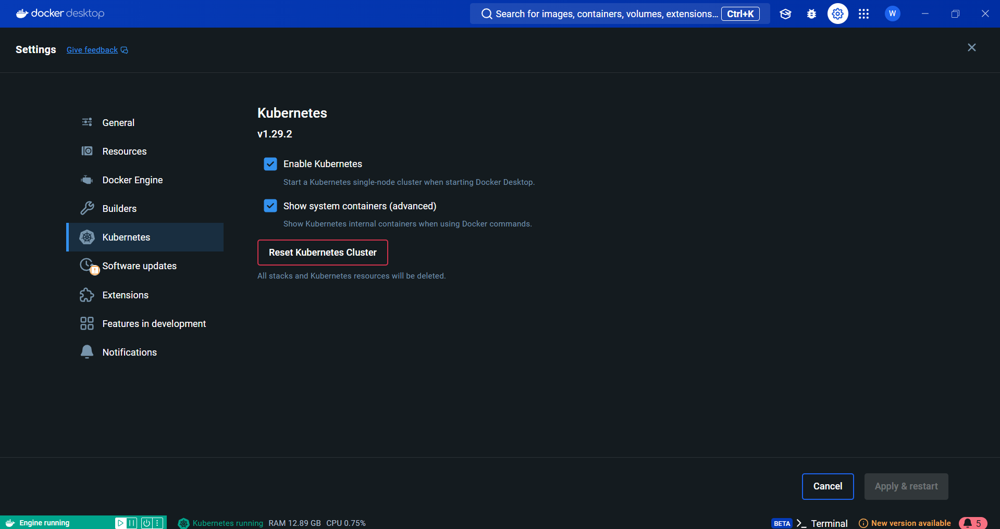
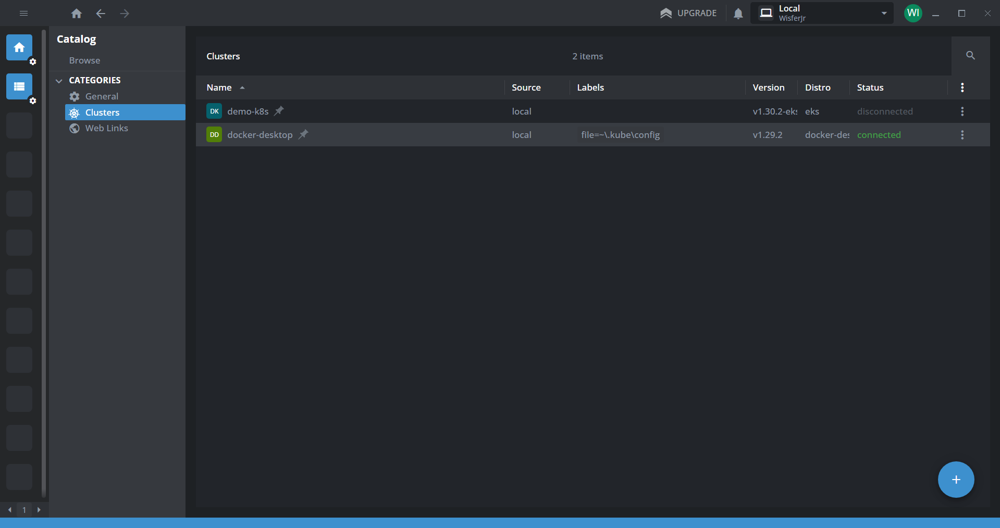
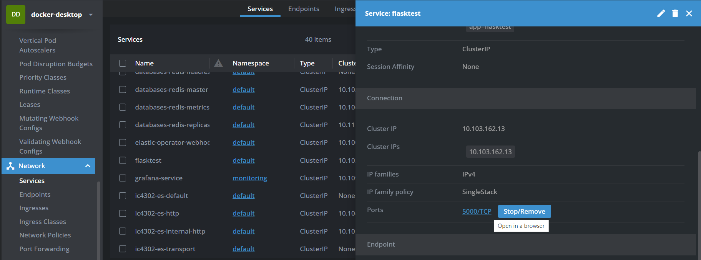
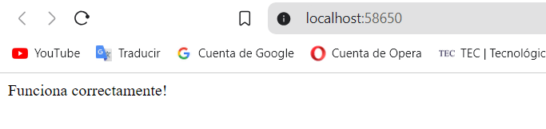
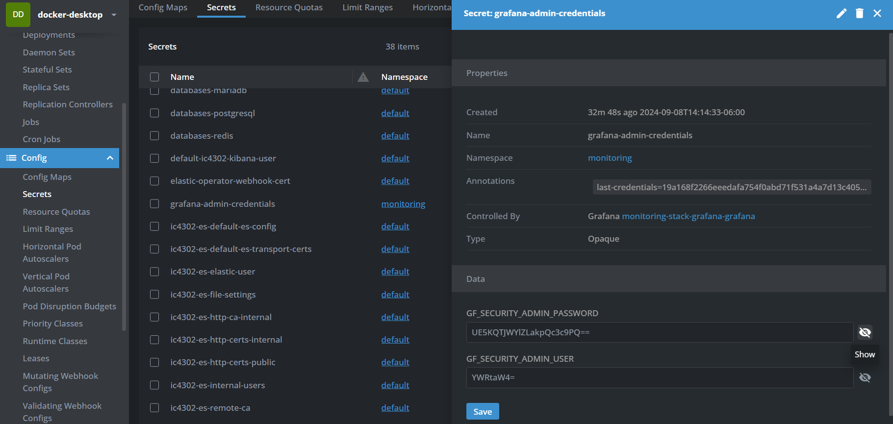
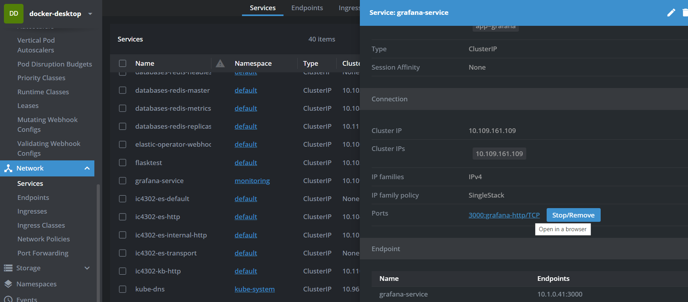
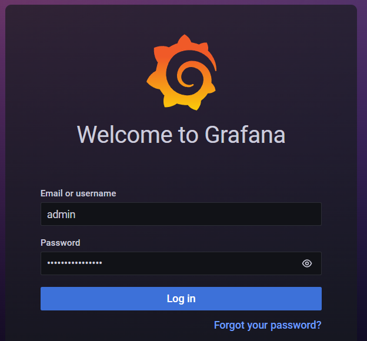
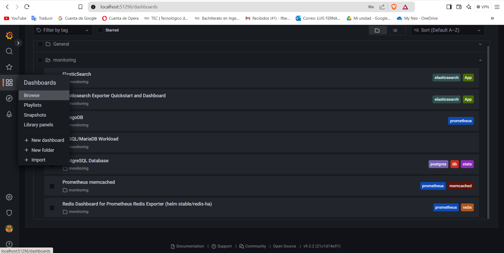
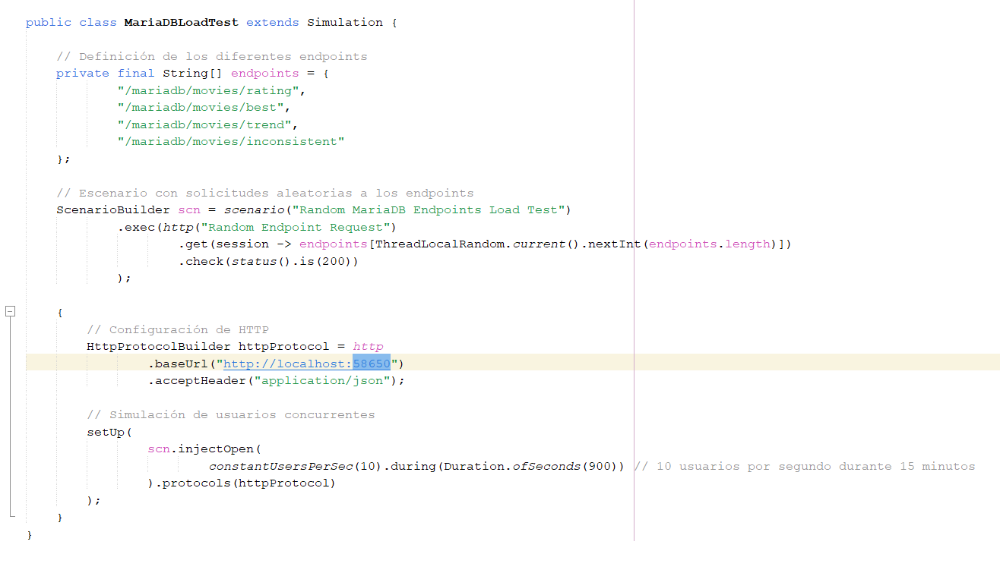

# Documentación de la Tarea Corta 1

Andrés Bonilla Solano - 2023101220  
Luis Fernando Benavides Villegas - 2023072689  
Juan Diego Jiménez - 2019199111  
Alex Naranjo - 2023063599 

## **Instrucciones para la Ejecución:**

### 1. Instalación y Configuración de Docker

* Crear un usuario de [DockerHub](https://hub.docker.com/).
* Instalar [Docker Desktop](https://docs.docker.com/desktop/install/windows-install/).
* Una vez instalado, iniciar sesión y en **Settings > Kubernetes** activar la casilla de Habilitar Kubernetes.



### 2. Otras Instalaciones

* Instalar [Kubectl](https://kubernetes.io/docs/tasks/tools/install-kubectl-macos/).
* Instalar [Helm](https://helm.sh/docs/intro/install/).
* Instalar [Lens](https://k8slens.dev/).
* Instalar [Visual Studio Code](https://code.visualstudio.com/).

### 3. Hacer el Build de las Imágenes de Docker

En una terminal de bash correr las siguientes líneas:
Recordar cambiar donde dice **user** con su usuario de DockerHub.

```bash
cd ./docker
./build.sh user
```

### 4. Configurar y Hacer el Install

Antes de comenzar con el install es necesario modificar el usuario de DockerHub
* Buscar en el proyecto **/charts/app/values.yaml**.
* Una vez dentro, en las primeras líneas de código hay que reemplazar el user con su usuario de DockerHub.

```yaml
config:
  flask:
    enabled: true
    name: flasktest
    replicas: 10
    image: user/flask-example 
```

* Buscar en el proyecto **/charts/LoadData/values.yaml**.
* Una vez dentro, en las primeras líneas de código hay que reemplazar el user con su usuario de DockerHub.

```yaml
image:
  repository: user/load-data
```

Una vez hecho este cambio, se ejecuta el install en una terminal de bash:

```bash
cd ./charts
./install.sh
```

En caso de que ocurra un error en la creación de los índices de elasticsearch, puede correr:

```bash
cd ./charts
./loadElasticIndexes.sh
```

Para hacer la desinstalación, puede ejecutar:

```bash
cd ./charts
./uninstall.sh
```

### 5. Hacer GET con los Endpoints

Primero, para acceder al puerto en el que se ejecuta la app de Flask. Para esto abrimos **Lens**, y buscamos en **Catálogo > Categorías > Clusters** y entrar al que se llama **docker-desktop**  



Una vez dentro, ir a **Network > Services** y buscar por el servicio llamado **flasktest**, bajar hasta la sección **Ports** y dar click.  



Al abrirlo en el navegador, va a mostrar un mensaje de que todo funciona correctamente.  


  
Hay 4 endpoints para cada base de datos que retornan la misma información, estos son:  
**Rating:** Peliculas con un rating promedio mayor a 3.5  
**Best:** Películas mejor valoradas con más de 250 calificaciones  
**Trend:** Tendencia de calificaciones a lo largo del tiempo para la película "Star Wars: Episode IV - A New Hope (1977)"  
**Inconsistent:** Películas con calificaciones inconsistentes (calificaciones que varían demasiado entre usuarios)  
  
Para solicitar datos, puede agregar lo siguiente a la ruta que tiene en el navegador:

**MariaDB**  

```
/mariadb/movies/rating
/mariadb/movies/best
/mariadb/movies/trend
/mariadb/movies/inconsistent
```

**PostgreSQL**  

```
/postgresql/movies/rating
/postgresql/movies/best
/postgresql/movies/trend
/postgresql/movies/inconsistent
```

**ElasticSearch**  

```
/elasticsearch/movies/rating
/elasticsearch/movies/best
/elasticsearch/movies/trend
/elasticsearch/movies/inconsistent
```

**Caches**  
Para acceder con la caché, puede añadir esto al final de cualquiera de las rutas:
```
?cache=memcached
?cache=redis
```
Por ejemplo, 
```
/mariadb/movies/rating?cache=memcached
```

**Metrics**
```
/metrics
```
  
### 6. Ver los Dashboards en Grafana

Primero, ocupamos la contraseña, hay que ir a **Config > Secrets** y buscar el secreto llamado **grafana-admin-credentials**, bajar hasta la sección **GF_SECURITY_ADMIN_PASSWORD**, darle al ojo para mostrarla y copiarla.



Luego volvemos a **Network > Services** y buscar por el servicio llamado **grafana-service**, bajar hasta la sección **Ports** y dar click.  



Nos va a solicitar un **usuario** y una **contraseña**, la contraseña es la que copiamos anteriormente, y el usuario es **admin**.



Una vez dentro, podemos buscar la sección de **Dashboards** en la barra lateral, y al darle en **Browse** podremos ver todos los dashboards que tenemos en este proyecto.



Es tan sencillo como buscar y acceder al que desee desde la carpeta monitoring.

### 7. Ejecutar pruebas de Gatling.

Para ejecutar las pruebas de gatlin, es recomendado abrir en NetBeans u otro editor para Java el programa de Gatling. Este se encuentra en la ruta **/Gatling/gatling-maven-plugin-demo-java-main/src/test/java/com/gatling/** y es el archivo que se llama **elasticsearchLoadTestWithMemcached.java**. En el documento **Pruebas.md** están las posibles pruebas que están prediseñadas. Para el ejemplo usaremos la siguiente:

```Java
public class MariaDBLoadTest extends Simulation {

    // Definición de los diferentes endpoints
    private final String[] endpoints = {
            "/mariadb/movies/rating",
            "/mariadb/movies/best",
            "/mariadb/movies/trend",
            "/mariadb/movies/inconsistent"
    };

    // Escenario con solicitudes aleatorias a los endpoints
    ScenarioBuilder scn = scenario("Random MariaDB Endpoints Load Test")
            .exec(http("Random Endpoint Request")
                    .get(session -> endpoints[ThreadLocalRandom.current().nextInt(endpoints.length)])
                    .check(status().is(200))
            );

    {
        // Configuración de HTTP
        HttpProtocolBuilder httpProtocol = http
                .baseUrl("http://localhost:51674")
                .acceptHeader("application/json");

        // Simulación de usuarios concurrentes
        setUp(
                scn.injectOpen(
                        constantUsersPerSec(10).during(Duration.ofSeconds(900)) // 10 usuarios por segundo durante 15 minutos
                ).protocols(httpProtocol)
        );
    }
}
```

Este código lo copiamos y lo pegamos en el archivo .java, y cambiamos el puerto en por el del port forward de flasktest.
```Java
HttpProtocolBuilder httpProtocol = http
                .baseUrl("http://localhost:51674") // <---- Cambiar aqui
                .acceptHeader("application/json");
```



Posteriormente, vamos a abrir una terminal en el directorio **gatling-maven-plugin-demo-java-main**, y ejecutar:
```
./mvnw.cmd gatling:test
```

Esto va a comenzar a ejecutar la prueba solicitada, y se puede apreciar el impacto en Grafana.

## Recomendaciones
1. La optimización de recursos es recomendable porque al monitorizar los datos de las bases de datos se puede ajustar la configuración de de recursos asignados, debido a que los recursos mal asigniados pueden crear problemas de rendimiento en el sistema, especialmente cuando se trabaja con cargas de trabajo grandes.

1. Además se planteó y se recomienda que los despliegues sean automaticos, mediante la utilización de herramientas de integración continua para automatizar la instalación y configuración de Helm Charts, de modo que se puedan reducir los riesgo de errores y aumentar la cosistencia en cada despliegue que se ejecute.

1. Realizar pruebas de escalabilidad periodicamente ayuda para la aseguraciónde que las bases de datos esten trabajando correctamente, y principalmente para asegurar que puedan manejar el crecimiento de datos cuidando el rendimiento.

1. En este caso se utilizaron dashboards ya definidos, pero se recomienda que se puedan ir mejorando esto mediante el refinamiento y personalizando los dashboards de Grafana para tener una clara visión de los graficos de datos que se ocupan princpalmente para el proyecto.

1. Se recomienda tomar en cuenta la implementación de caches distribuidas utilizando Redis o Memcached en configuraciones complejas para mejorar la disponibilidad y tolerancia a fallos.

1. Se debe tomar en cuenta la optimización de consultas, debido a las diferentes bases de datos que se utilizan, por lo que se debe revisar y optimizar las consultas SQL y NoSQL en la aplicación para asegurarse de que están aprovechando al máximo las capacidades de las bases de datos.

1. Se **recomienda la capacitación de personal** para trabajar con las herramientas y tecnologías utilizadas, como Kubernetes, Prometheus, Grafana, Redis, ElasticSearch y **Docker**, para asegurar un manejo eficiente y efectivo del sistema.

1. Además el uso de helm charts debe de estar pptimizadopara para eliminar cualquier redundancia o configuraciones innecesarias, lo que ayuda a la eficiencia del despliegue y reducice los tiempos de ejecución.

1. Tener un buen plan para la revisión de metricas de rendimiento y recursos, permite que los implicados en el desarrollo del sistema puedan hacer ajustes proactivos en la infraestructura antes de que los problemas puedan afectar al sistema.

1. Además, se puede considerar la implementación de escalado horizontal para bases de datos como ElasticSearch, PostgreSQL y Redis, lo que permite que el sistema maneje la carga de trabajo si descuidar el rendimiento del sistema.

## Conclusiones
1. La información obtenida de las pruebas de carga y el monitoreo en tiempo real ha proporcionado datos valiosos que han mejorado la toma de decisiones respecto a la gestión de la infraestructura de bases de datos.

1. Además el uso/implementación de caches, mejora la confiabilidad general del sistema, por lo que es posible garantizar que el sistema trabaje por un tiempo más prolongado y haciendo que las interrupciones del servicio disminuyan en gran medida.

1. Además como se mencionó en clases el tener un sistema optimizado en la configuración y que el monitoreo sea constante, pueden llevar a una reducción significativa de los costos, ya que, minimiza el uso de recursos innecesarios y mejorar la eficiencia del sistema.

1. La implementación de una solución de observabilidad ha mejorado en gran medida a mejorar la capacidad de respuesta ante incidentes. Además la recopilación y análisis en tiempo real de métricas y logs permite detectar rápidamente anomalías en el comportamiento del sistema

1. A parte de la ayuda que proporciona el uso de Prometheus y Grafana mediante el monitoreo detallado y en tiempo real de las bases de datos, también nos ayudó a entender de mejor manera el uso y comportamiento del sistema bajo diferentes cargas de trabajo.

1. Además las pruebas de carga (de 15 minutos) realizadas ayudan en la visibilidad de que el sistema mantiene un desempeño consistente incluso bajo condiciones de demanda, por lo que se puede concluir que el diseño del trabajo fue correcto.

1. La flexibilidad en la configuración de Helm Charts ayuda significativamente a optimizar la gestión y despliegue de las herramientas necesarias para la observabilidad del sistema, permitiendo personalizar fácilmente las configuraciones según las necesidades específicas del entorno.

1. Utilizar herramientas como Redis y Memcached ha permitido que el sistema se adapte fácilmente a diferentes escenarios y necesidades, mejorando la eficiencia general. Estas soluciones de almacenamiento en caché han reducido significativamente los tiempos de respuesta al disminuir la carga de las bases de datos

1. La integración de dashboards en Grafana mejora significativamente la visibilidad de las operaciones del sistema, lo que ayuda a tener una mejor gestión y monitoreo continuo del sistema.

1. Éxito en la Implementación del Proyecto: En general, al haber implementado en esta solución la observabilidad, ha producido resultados exitosos, de manera que se pudo cumplir con la creación de una plataforma robusta y escalable para el monitoreo y gestión de bases de datos.
