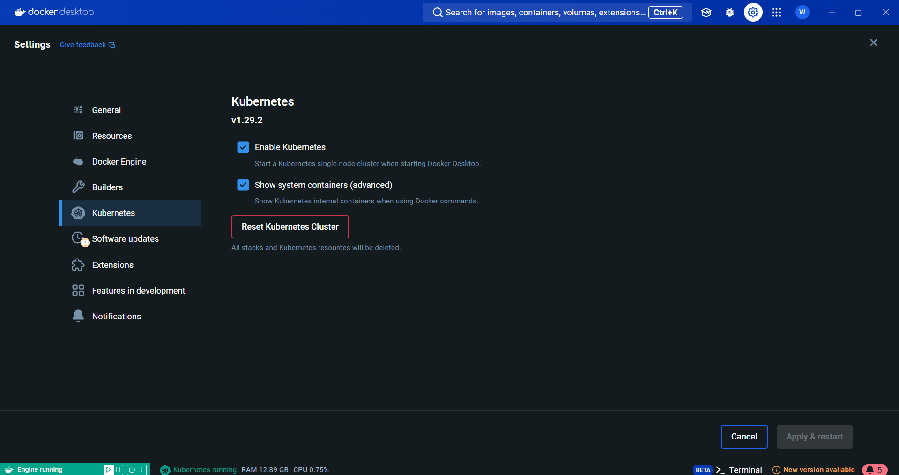
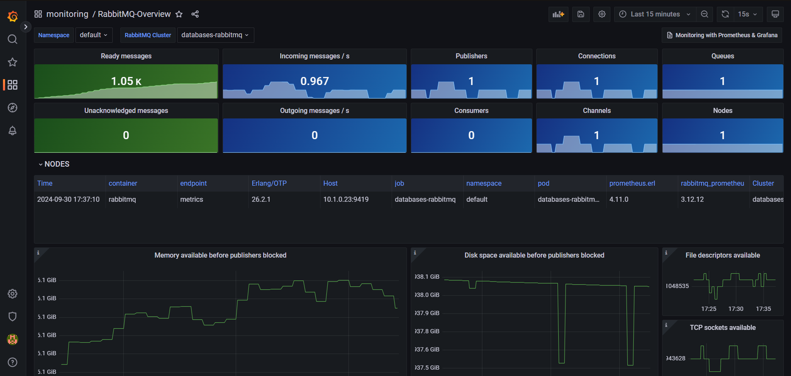

# Documentación del Proyecto #1

Andrés Bonilla Solano - 2023101220  
Luis Fernando Benavides Villegas - 2023072689  
Juan Diego Jiménez - 2019199111  
Alex Naranjo - 2023063599 

- [**Instrucciones Para Ejecutar el Proyecto**](#instrucciones-para-ejecutar-el-proyecto)
- [**Dahboards de Grafana**](#dahboards-de-grafana)
- [**Pruebas Realizadas**](#pruebas-realizadas)
- [**Resultados de las Pruebas Unitarias**](#resultados-de-las-pruebas-unitarias)
- [**Explicación de Cada Componente**](#explicación-de-cada-componente)
    - [Estructura del Proyecto](#estructura-del-proyecto)
    - [1. Hugging Face API](#1-hugging-face-api)
    - [2. API](#2-api)
    - [3. UI](#3-ui)
    - [4. S3-Crawler](#4-s3-crawler)
    - [5. Ingest](#5-ingest)
    - [6. Bases de datos](#6-bases-de-datos)
- [**Recomendaciones y Conclusiones**](#recomendaciones-y-conclusiones)
- [**Referencias Bibliográficas**](#referencias-bibliográficas)

<div style="page-break-after: always;"></div>

## **Instrucciones Para Ejecutar el Proyecto**

### 1. Instalación y Configuración de Docker

* Crear un usuario de [DockerHub](https://hub.docker.com/).
* Instalar [Docker Desktop](https://docs.docker.com/desktop/install/windows-install/).
* Una vez instalado, iniciar sesión y en **Settings > Kubernetes** activar la casilla de Habilitar Kubernetes.



### 2. Otras Instalaciones

* Instalar [Kubectl](https://kubernetes.io/docs/tasks/tools/install-kubectl-macos/).
* Instalar [Helm](https://helm.sh/docs/intro/install/).
* Instalar [Lens](https://k8slens.dev/).
* Instalar [Visual Studio Code](https://code.visualstudio.com/).

### 3. Hacer el Build de las Imágenes de Docker

En una terminal de bash correr las siguientes líneas:
Recordar cambiar donde dice **user** con su usuario de DockerHub.

```bash
cd ./docker
./build.sh user
```

### 4. Configurar y Hacer el Install

Antes de comenzar con el install es necesario modificar el usuario de DockerHub
* Buscar en el proyecto **charts/application/values.yaml**.
* Una vez dentro, en las primeras líneas de código hay que reemplazar el usuario con su usuario de DockerHub.

```yaml
config:
 docker_registry: user
```

Una vez hecho este cambio, se ejecuta el install en una terminal de bash:

```bash
cd ./charts
./install.sh
```

Para hacer la desinstalación, puede ejecutar:

```bash
cd ./charts
./uninstall.sh
```

### 5. Acceder a la UI
Para esto abrimos **Lens**, y buscamos en **Catálogo > Categorías > Clusters** y entrar al que se llama **docker-desktop**.
Una vez dentro, ir a **Network > Services** y buscar por el servicio llamado **ui-nodeport**, bajar hasta la sección Ports y dar click en el puerto. Esto abrirá una ventana en el navegador.


### 6. Iniciar Sesión

Una vez abierta la UI, crear un usuario es tan sencillo como escribir su nombre y contraseña en el campo correspondiente y dar click en el botón de registrarse. Una vez creado, se le da al botón de login y ya podrá explorar las opciones de la aplicación.


### 7. Hacer una Consulta

En la ventana **Ask** es posible escribir un prompt y enviarlo. Esto nos va a dar una lista de canciones relacionadas. 


El resto de funciones de la aplicación son expicadas más adelante, en la [documentación del componente](#3-ui).

<div style="page-break-after: always;"></div>


## **Dahboards de Grafana**

Primero, buscamos en **Services** el servicio llamado **grafana-service** y accedemos al puerto.


Una vez dentro, nos va a pedir una contraseña. Esta la podemos encontrar en **Config > Secrets**, en el secreto llamado **grafana-admin-credentials**. Solo le damos a mostrar y la copiamos. El usuario es **admin**.


Una vez logueados, podemos ver los dashboards de todos los componentes de esta solución en la sección de dashboards. 

### **Bases de Datos:**

- ### Elasticseach


- ### MariaDB


- ### Memcached


- ### RabbitMQ


### **Aplicaciones:**

- ### Hugging-Face-API


- ### Flask API


- ### S3-Crawler


- ### Ingest


<div style="page-break-after: always;"></div>

## **Pruebas Realizadas**

Revisión de pods para verificar si están funcionando correctamente. Además, para probar los diferentes componentes se tienen dos tipos de prueba, estos son: pruebas con Postman en el caso de la API escrita en Python con Flask y pruebas unitarias en el caso del Hugging Face API, Ingest, Flask API y el S3 Crawler. Además, se mostraran pruebas utilizando la UI creada para el proyecto.

Para las pruebas unitarias solo hay que ejecutar el proyecto y luego revisar en la consola al ejecutar el comando de *build.sh* si las pruebas tuvieron exito. Esto se verá parte por partes en el siguiente apartado donde se mostraran los resultados de las pruebas unitarias.

## **Resultados de las Pruebas Unitarias**  

Se realizaron pruebas unitarias para la Hugging Face API, Ingest, Flask API y el S3 Crawler. Los resultados de cada una de las pruebas se mostraran al ejecutar **build.sh**. 
Para las pruebas unitarias, se utilizó la librería de unittest que viene incluida en las versiones más recientes de python. En caso de que las pruebas sean existosas en los logs del pods debería aparecer "RAN {numero_de_tests} in {tiempo_de_ejecución}" y luego un "OK". En caso contrario en lugar del "OK", aparece FAILED (failures={numero_de_fails}) y indica en que linea falló y que tipo de error ocurrió.  
En las siguientes imagenes, están los resultado de las pruebas unitarias de cada uno de los componentes. Asimismo, se utilizó la librería **moto** para simular los servicios de AWS y el módulo mock de unit test para simular objetos, servicios externos y partes de las funciones.  

### Hugging Face API
En este módulo se probaron 3 endpoints. Los endpoints que se probaron son **/status**, **/encode** y **/**. Para el encode se hicieron dos unit tests ya que también se probó el caso en que no se tenga el campo de *text*.  


### Ingest
Los distintos mensajes que salen en la imagen son logs para verificar que ciertas partes de algunas funciones se esten ejecutando correctamente. Algunas funciones en este módulo cuentan con varios unit tests para verificar distintos casos, por ejemplo en el caso de que se tenga éxito y el caso de que se haya producido un error. Este es el caso funciones como *generate_embedding()*, *process_csv()* y *callback()*.  


### S3 Crawler
Para el S3 Crawler solamente hay dos funciones **(get_csv() y publish_csv_to_rabbitmq)** por lo tanto es una prueba para cada función. Para hacer estas pruebas se simularon los servicios de S3 y los de RabbitMQ.  


### Flask API
Para esta parte se realizaron un total de 29 pruebas. Esto se debe a que hay varias funciones donde se probaron varios casos. Por lo tanto para mantener el orden, en el archivo de unitTest.py dentro de la carpeta /flask-api/app se creo una clase por cada función. Hay funciones como **Ask()** que tienen hasta cuatro pruebas y funciones como **Like()** que tienen tres pruebas, aunque estas son excepciones ya que la mayoria de funciones tienen una o dos pruebas.  


<div style="page-break-after: always;"></div>

## **Explicación de Cada Componente**

### Estructura del Proyecto


<div style="page-break-after: always;"></div>

### 1. Hugging Face API

Esta API se utiliza para generar dos cosas en particular:

1. Los vectores de las letras de las canciones, que se extraen de los objetos en el bucket que nos proporcionó el profesor.
2. Los vectores para la búsqueda por vectores (`Vector Search`), que se usa en otra API.

Es una API bastante sencilla, hecha en Flask, que cuenta con 4 rutas principales:

#### 1.1. Ruta / (GET)
```python
@app.route("/")
def index():
    return "Funciona correctamente!"
```
Retorna simplemente un mensaje confirmando que la API está funcionando correctamente.

#### 1.2. Ruta /status (GET)
```python
@app.route("/status")
def status():
    logger.info("Se accedió al endpoint /status .")
    text = "This is my best example. I'll play well today \n John is my name"
    embedding = model.encode(text)
    return jsonify({"embedding": embedding.tolist(), "text":text})
```
Devuelve un JSON con la siguiente estructura:

```json
{
    "embedding": [
        "vector de 768 dimensiones"
    ],
    "text": "texto de ejemplo definido en la ruta"
}
```
Sirve para comprobar que el modelo de generación de vectores está funcionando correctamente.

#### 1.3. Ruta /encode (POST) 
```python
@app.route("/encode", methods=["POST"])
def generateVector():
    REQUEST_COUNT.labels(endpoint='/encode').inc()  # Incrementar el contador de requests

    # Medir el tiempo que tarda en generar el embedding
    with REQUEST_LATENCY.labels(endpoint='/encode').time():
        # Obtener el JSON del body
        data = request.get_json()
        text = data.get("text")
        
        # Verifica si el campo 'text' fue enviado
        if text is None:
            logger.error("Error: El campo 'text' es requerido.")
            return jsonify({"error": "El campo 'text' es requerido"}), 400
        
        # Codificar el texto
        embedding = model.encode(text)
        
        # Crear la estructura del JSON que será retornado
        response = {
            "embeddings": embedding.tolist(),  # Convertir a lista si es un vector de numpy
            "text": text
        }

    logger.info("Embeddings generados exitosamente.")
    # Retornar el JSON
    return jsonify(response)
```
Similar a la anterior, pero es un método POST, que recibe un texto y devuelve su vector correspondiente. Por ejemplo, si enviamos el texto `"Hola"`, la respuesta sería:

```json
{
    "embedding": [
        "vector de 768 dimensiones"
    ],
    "text": "Hola"
}
```

#### 1.4. Ruta /metrics
```python
@app.route("/metrics")
def metrics():
    return generate_latest(), 200
```
Esta es la ruta que utiliza Prometheus para obtener las métricas de esta API.

<div style="page-break-after: always;"></div>

### 2. API
API encargada de manejar todas las rutas, de la UI, tales como el manejo de usuarios las busquedas por vector search, etc.

#### 2.1. Importaciones y Configuración Básica
```python
from flask import Flask, jsonify, request
from flask_cors import CORS
import requests
from elasticsearch import Elasticsearch
import os
import pylibmc
import boto3
import pymysql
from datetime import datetime
from prometheus_client import start_http_server, Summary, Counter, Histogram, generate_latest
import base64
import zlib
import json
import logging
```
Esta sección importa todas las bibliotecas necesarias para que la API funcione:
- **Flask:** Framework que permite crear aplicaciones web en Python. Aquí se usa para definir las rutas y manejar las solicitudes HTTP.
- **CORS:** Biblioteca que permite la Cross-Origin Resource Sharing, es decir, permite que la API sea accesible desde otros dominios, resolviendo problemas de seguridad relacionados con peticiones entre diferentes dominios.
- **requests:** Se usa para hacer solicitudes HTTP a otros servicios, como el servicio Hugging Face en este caso.
- **Elasticsearch:** Cliente para conectarse y hacer búsquedas en un servidor de Elasticsearch.
- **os:** Para acceder a variables de entorno del sistema, como credenciales y configuraciones.
- **boto3:** Cliente para interactuar con servicios de Amazon Web Services (AWS), aunque no se utiliza en el código actual.
- **pymysql:** Para conectarse y trabajar con bases de datos MariaDB/MySQL.
- **datetime:** Se utiliza para manejar fechas y horas, por ejemplo, al registrar cuándo se publica un "prompt".
- **prometheus_client:** Crear el cliente de prometheus para generar métricas.
- **base64:** Para codificar contraseñas en base64 antes de almacenarlas en la base de datos.
- **zlib:** Para comprimir datos antes de insertarlos en cache.
- **json:** Biblioteca para trabajar con documentos json.
- **logging:** Para facilitar registros y registrar info.

#### 2.2. Inicialización de la Aplicación Flask y Configuración de CORS
  ```python
    app = Flask(__name__)
    CORS(app, resources={r"/*": {"origins": "*"}})
  ```
  - Flask app: Crea una instancia de la aplicación Flask.
  - CORS: Permite que la API acepte peticiones de cualquier origen (*), lo que facilita el acceso desde cualquier frontend o aplicación web que desee usar esta API.

#### 2.3. Configuración de Variables de Entorno
```python
# Configuración de hugging-face-api
HUGGING_FACE_API = os.getenv('HUGGING_FACE_API')
HUGGING_FACE_API_PORT = os.getenv("HUGGING_FACE_PORT")

# Configuración de Elasticsearch
ELASTIC_PASSWORD = os.getenv("ELASTIC_PASS")
ELASTIC_USER = os.getenv("ELASTIC_USER")
ELASTIC_SERVICE = os.getenv("ELASTIC")
ELASTIC_PORT = os.getenv("ELASTIC_PORT")

# Configuración de MariaDB
MARIADB_USER = os.getenv('MARIADB_USER')
MARIADB_PASS = os.getenv('MARIADB_PASS')
MARIADB = os.getenv('MARIADB')
MARIADB_DB = os.getenv('MARIADB_DB')
MARIADB_TABLE = os.getenv('MARIADB_TABLE')

# Configuracion de Memcached
MEMCACHED_HOST = os.getenv('MEMCACHED_HOST')
MEMCACHED_PORT = os.getenv('MEMCACHED_PORT')
```
Se obtienen todas las variables de entorno necesarias para el buen funcionamiento de la API

#### 2.4. Conexión a Elasticsearch y Memcached
```python
es_url = f"http://{ELASTIC_SERVICE}:{ELASTIC_PORT}"
es = Elasticsearch(es_url, basic_auth=(ELASTIC_USER, ELASTIC_PASSWORD))

memcached_client = pylibmc.Client([f"{MEMCACHED_HOST}:{MEMCACHED_PORT}"])
```
- Se crea una instancia del cliente de Elasticsearch usando la URL del servidor y las credenciales de usuario (nombre de usuario y contraseña).
- Este cliente permite hacer consultas de búsqueda, inserciones, etc., en un servidor de Elasticsearch.
- Se crea una instancia del cliente de Memcached para guardar y buscar datos guardados en cache.

#### 2.5. Configuración y Conexión a MariaDB
```python
mariadb_config = {
    'host': MARIADB,
    'user': MARIADB_USER,
    'password': MARIADB_PASS,
    'database': MARIADB_DB
}
def get_connection():
    return pymysql.connect(
        host=os.getenv('MARIADB'),
        user=os.getenv('MARIADB_USER'),
        password=os.getenv('MARIADB_PASS'),
        db=os.getenv('MARIADB_DB')
    )
```
- Se configuran las credenciales y parámetros de conexión para MariaDB, obtenidos de las variables de entorno.
- La función get_connection() crea una conexión a la base de datos MariaDB cada vez que sea necesario interactuar con ella, por ejemplo, para registrar usuarios o recuperar datos.

#### 2.6. Ruta de Validación: /
```python
@app.route("/")
def index():
    return "Funciona correctamente!"
```
- Esta ruta es un endpoint básico que responde con el texto "Funciona correctamente!" para indicar que la API está funcionando.

#### 2.7. Registro de Usuarios: /register
```python
# Ruta para registrar usuarios
@app.route("/register", methods=["POST"])
def register():
    # Incrementar el contador de requests
    REQUEST_COUNT.labels(method='POST', endpoint='/register').inc()

    # Medir el tiempo de procesamiento
    with REQUEST_TIME_WITHOUT_CACHE.labels(method='POST', endpoint='/register').time():
        data = request.get_json()
        username = data.get("username")
        password = data.get("password").encode('utf-8')

        # Codificar la contrasena
        encryptedPassword = base64.b64encode(password).decode('utf-8')

        connection = get_connection()
        try:
            with connection.cursor() as cursor:
                sql = "INSERT INTO users (username, password) VALUES (%s, %s)"
                cursor.execute(sql, (username, encryptedPassword))
                connection.commit()

            return jsonify({"status": "Usuario registrado con éxito"}), 200
        finally:
            connection.close()
```
- Este endpoint registra nuevos usuarios. La solicitud debe ser de tipo POST.
- La contraseña se codifica en Base64 antes de almacenarse en la base de datos para evitar guardar contraseñas en texto plano.
- Se realiza una conexión a la base de datos y se inserta el usuario con su contraseña.

#### 2.8. Login de Usuarios: /login
```python
# Ruta para loguear usuarios
@app.route("/login", methods=["POST"])
def login():
    # Incrementar el contador de requests
    REQUEST_COUNT.labels(method='POST', endpoint='/login').inc()

    # Medir el tiempo de procesamiento
    with REQUEST_TIME_WITHOUT_CACHE.labels(method='POST', endpoint='/login').time():
        data = request.get_json()
        username = data.get("username")
        password = data.get("password").encode('utf-8')

        # Encriptamos la contraseña como antes
        encryptedPassword = base64.b64encode(password).decode('utf-8')

        connection = get_connection()
        try:
            with connection.cursor() as cursor:
                sql = "SELECT username FROM users WHERE username = %s and password = %s"
                cursor.execute(sql, (username, encryptedPassword))
                result = cursor.fetchone()

                if result is None:
                    return jsonify({"status": "Inicio fallido"}), 404
                else:
                    return jsonify({"status": "Inicio de sesión exitoso"}), 200
        finally:
            connection.close()
```
- Esta ruta permite que los usuarios inicien sesión.
- La contraseña se encripta en Base64 y se compara con la almacenada en la base de datos.
- Si las credenciales coinciden, se devuelve un mensaje de éxito; de lo contrario, un mensaje de error.

#### 2.9. Generación de Resultados: /ask
```python
# Ruta para generar los resultados de una consulta (ask)
@app.route("/ask", methods=["POST"])
def ask():
    # Incrementar el contador de requests
    REQUEST_COUNT.labels(method='POST', endpoint='/ask').inc()

    # Obtener el JSON del body
    data = request.get_json()
    question = data.get("question")
    
    # Verificar si el campo 'question' fue enviado
    if question is None:
        return jsonify({"error": "El campo 'question' es requerido"}), 400

    # Eliminar espacios de la pregunta
    question_key = question.replace(" ", "")  # O usar .strip() para eliminar espacios al inicio y al final si es necesario

    try:
        # Verificar si está habilitado el cache y si existe un resultado cacheado
        if USE_CACHE:
            cached_result = memcached_client.get(question_key)  # Buscar en cache sin espacios
            if cached_result:
                with REQUEST_TIME_WITH_CACHE.labels(method='POST', endpoint='/ask').time():
                    decompressed_data = json.loads(zlib.decompress(cached_result).decode('utf-8'))  
                    CACHE_HITS.labels(cache_type='memcached').inc()  # Incrementar cache hit
                    return jsonify(decompressed_data)  # Devolver el resultado cacheado inmediatamente
            else:
                CACHE_MISSES.labels(cache_type='memcached').inc()  # Incrementar cache miss

        # Si no se encuentra en cache o no se está usando cache, medimos el tiempo de procesamiento
        with REQUEST_TIME_WITHOUT_CACHE.labels(method='POST', endpoint='/ask').time():
            # Codificar el texto usando el servicio de Hugging Face
            with EMBEDDING_PROCESSING_TIME.labels(method='POST', endpoint='/ask').time():
                response_hf = requests.post(f"http://{HUGGING_FACE_API}:{HUGGING_FACE_API_PORT}/encode", json={"text": question})

            # Verificar si la respuesta fue exitosa
            if response_hf.status_code != 200:
                return jsonify({"error": "Error al obtener el embedding"}), 500
            
            # Obtener el embedding del JSON
            embedding_question = response_hf.json().get("embeddings", [])
            
            # Si no se encuentra el embedding
            if not embedding_question:
                return jsonify({"error": "No se pudo generar el embedding"}), 500
            
            # Definir la consulta KNN en Elasticsearch
            query_knn = {
                "knn": {
                    "field": "embedding",
                    "query_vector": embedding_question,
                    "k": 10,
                    "num_candidates": 50
                }
            }
            # Ejecutar la búsqueda en Elasticsearch
            response = es.search(index="songs", body=query_knn)
            
            # Crear la lista de resultados
            results = []
            for hit in response['hits']['hits']:
                song_name = hit['_source'].get('name', 'Unknown Song')
                lyrics = hit['_source'].get('lyrics', 'No lyrics available')
                artists = hit['_source'].get('artists', 'No artists available')
                # Agregar el resultado a la lista
                results.append({
                    "name": song_name,
                    "lyrics": lyrics,
                    "artists": artists
                })

            # Almacenar en cache si está habilitado
            if USE_CACHE:
                try:
                    compressed_data = zlib.compress(json.dumps(results).encode('utf-8'))
                    memcached_client.set(question_key, compressed_data, time=60)  # Guardar en cache sin espacios
                except Exception as e:
                    logger.error(f"Error al almacenar en cache: {e}")

            return jsonify(results)

    except Exception as e:
        return jsonify({"error": str(e)}), 500
```
- Esta ruta genera resultados de búsqueda basados en una pregunta.
- Envía la pregunta a la API de Hugging Face para obtener un embedding (representación vectorial de la pregunta).
- Con el embedding, realiza una búsqueda KNN (vecino más cercano) en Elasticsearch para encontrar canciones similares.
- Finalmente, devuelve una lista de canciones con su nombre, letra y artistas.

#### 2.10. Publicar Prompts: /publish
```python
# Ruta para publicar los prompts
@app.route("/publish", methods=["POST"])
def publish():
    # Incrementar el contador de requests
    REQUEST_COUNT.labels(method='POST', endpoint='/publish').inc()

    # Medir el tiempo de procesamiento
    with REQUEST_TIME_WITHOUT_CACHE.labels(method='POST', endpoint='/publish').time():
        data = request.get_json()
        prompt = data.get("prompt")
        username = data.get("username")

        connection = get_connection()
        try:
            with connection.cursor() as cursor:
                sql = "INSERT INTO prompts (username, prompt, date, likes) VALUES (%s, %s, %s, %s)"
                cursor.execute(sql, (username, prompt, datetime.now(), 0))
                connection.commit()

            return jsonify({"status": "Prompt publicado con éxito"}), 200
        finally:
            connection.close()
```
- Permite publicar un prompt en la base de datos, almacenando el usuario que lo publica, el prompt, la fecha y un contador de "me gusta" inicializado en 0

#### 2.11. Buscar Prompts: /search
```python
# Ruta para buscar por prompts similares
@app.route("/search", methods=["GET"])
def search():
    # Incrementar el contador de requests
    REQUEST_COUNT.labels(method='GET', endpoint='/search').inc()

    # Obtener el parámetro 'keyword' de la URL
    keyword = request.args.get("keyword")

    # Verificar si el parámetro 'keyword' fue enviado
    if keyword is None:
        return jsonify({"error": "El campo 'keyword' es requerido"}), 400

    # Eliminar espacios de la palabra clave
    keyword_key = keyword.replace(" ", "")  # O usar .strip() para eliminar espacios al inicio y al final si es necesario

    try:
        # Verificar si está habilitado el cache y si existe un resultado cacheado
        if USE_CACHE:
            cached_result = memcached_client.get(keyword_key)  # Buscar en cache sin espacios
            if cached_result:
                with REQUEST_TIME_WITH_CACHE.labels(method='POST', endpoint='/search').time():
                    decompressed_data = json.loads(zlib.decompress(cached_result).decode('utf-8'))  
                    CACHE_HITS.labels(cache_type='memcached').inc()  # Incrementar cache hit
                    return jsonify(decompressed_data)  # Devolver el resultado cacheado inmediatamente
            else:
                CACHE_MISSES.labels(cache_type='memcached').inc()  # Incrementar cache miss

        # Si no se encuentra en cache o no se está usando cache, medimos el tiempo de procesamiento
        with REQUEST_TIME_WITHOUT_CACHE.labels(method='POST', endpoint='/search').time():
            connection = get_connection()
            try:
                with connection.cursor() as cursor:
                    # Buscar en la base de datos usando LIKE
                    sql = "SELECT id, username, prompt, date, likes FROM prompts WHERE prompt LIKE %s"
                    cursor.execute(sql, ('%' + keyword + '%',))
                    results = cursor.fetchall()

                # Convertir los resultados en un formato legible (lista de diccionarios)
                prompts = []
                for result in results:
                    prompt = {
                        "id": result[0],
                        "username": result[1],
                        "prompt": result[2],
                        "date": result[3],
                        "likes": result[4]
                    }
                    prompts.append(prompt)

                # Almacenar en cache si está habilitado
                if USE_CACHE:
                    try:
                        compressed_data = zlib.compress(json.dumps({"results": prompts}).encode('utf-8'))  # Comprimir los resultados
                        memcached_client.set(keyword_key, compressed_data, time=60)  # Guardar en cache sin espacios
                    except Exception as e:
                        logger.error(f"Error al almacenar en cache: {e}")

                return jsonify({"results": prompts}), 200
            finally:
                connection.close()

    except Exception as e:
        return jsonify({"error": str(e)}), 500
```
- Esta ruta permite buscar prompts en la base de datos utilizando una palabra clave.
- Se realiza una consulta usando LIKE en SQL para buscar coincidencias parciales con el prompt.

#### 2.12. Dar Like a un Prompt: /like
```python
# Ruta para dar like a un prompt
@app.route("/like", methods=["POST"])
def like():
    # Incrementar el contador de requests
    REQUEST_COUNT.labels(method='POST', endpoint='/like').inc()

    # Medir el tiempo de procesamiento
    with REQUEST_TIME_WITHOUT_CACHE.labels(method='POST', endpoint='/like').time():
        data = request.get_json()
        username = data.get("username") 
        prompt_id = data.get("prompt_id")

        connection = get_connection()
        try:
            with connection.cursor() as cursor:
                # Verificar si el usuario ya ha dado "like" al prompt
                sql_check = "SELECT * FROM likes WHERE username = %s AND prompt_id = %s"
                cursor.execute(sql_check, (username, prompt_id))
                like_exists = cursor.fetchone()

                if like_exists:
                    return jsonify({"error": "You have already liked this prompt"}), 400

                # Insertar el "like" en la tabla de 'likes'
                sql_like = "INSERT INTO likes (username, prompt_id) VALUES (%s, %s)"
                cursor.execute(sql_like, (username, prompt_id))

                # Actualizar el número de "likes" en el prompt original
                sql_update_likes = "UPDATE prompts SET likes = likes + 1 WHERE id = %s"
                cursor.execute(sql_update_likes, (prompt_id,))

                # Verificar si se actualizó correctamente el número de likes
                cursor.execute("SELECT likes FROM prompts WHERE id = %s", (prompt_id,))
                updated_likes = cursor.fetchone()

                # Obtener el contenido del prompt para republicarlo
                sql_fetch = "SELECT prompt FROM prompts WHERE id = %s"
                cursor.execute(sql_fetch, (prompt_id,))
                prompt_data = cursor.fetchone()

                if not prompt_data:
                    return jsonify({"error": "Prompt not found"}), 404

                prompt_text = prompt_data[0]

                # Republicar el prompt bajo el nombre del usuario que dio "like"
                sql_republish = "INSERT INTO prompts (username, prompt, date, likes) VALUES (%s, %s, %s, %s)"
                cursor.execute(sql_republish, (username, prompt_text, datetime.now(), 0))

                connection.commit()

            return jsonify({"status": "Prompt liked and republished successfully", "updated_likes": updated_likes[0]}), 200
        finally:
            connection.close()
```
- Esta ruta permite que los usuarios den 'like' a un prompt. Se verifica primero si el usuario ya ha dado 'like' al prompt, y si no lo ha hecho, se inserta un registro en la tabla de 'likes' y se incrementa el contador de likes del prompt.
- Si el prompt no es encontrado, se devuelve un error 404.

#### 2.13. Obtener el Perfil de Usuario: /me/getProfile
```python
# Ruta para obtener mi usuario
@app.route("/me/getProfile", methods=["GET"])
def getProfile():
    # Incrementar el contador de requests
    REQUEST_COUNT.labels(method='GET', endpoint='/me/getProfile').inc()

    # Medir el tiempo de procesamiento
    with REQUEST_TIME_WITHOUT_CACHE.labels(method='GET', endpoint='/me/getProfile').time():
        data = request.get_json()
        username = data.get("username")

        connection = get_connection()
        try:
            with connection.cursor() as cursor:
                sql = "SELECT username FROM users WHERE username = %s"
                cursor.execute(sql, (username))
                result = cursor.fetchone()

                return jsonify({"results": result}), 200
        finally:
            connection.close()
```
- Esta ruta devuelve el perfil del usuario. Se espera que el usuario envíe su nombre de usuario en el cuerpo de la solicitud.
- La consulta a la base de datos busca el usuario por su nombre y devuelve la información básica de su perfil.

#### 2.14. Actualizar el Nombre de Usuario: /me/updateUsername
```python
@app.route("/me/updateUsername", methods=["POST"])
def updateUsername():
    # Incrementar el contador de requests
    REQUEST_COUNT.labels(method='POST', endpoint='/me/updateUsername').inc()

    # Medir el tiempo de procesamiento
    with REQUEST_TIME_WITHOUT_CACHE.labels(method='POST', endpoint='/me/updateUsername').time():
        data = request.get_json()
        username = data.get("username")
        password = data.get("password").encode('utf-8')
        newUsername = data.get("newUsername")
        encryptedPassword = base64.b64encode(password).decode('utf-8')  # Encripta la contraseña

        connection = get_connection()
        try:
            with connection.cursor() as cursor:
                # Desactivar restricciones de clave foránea
                cursor.execute("SET FOREIGN_KEY_CHECKS = 0;")
                
                # Verificar si el usuario y la contraseña son correctos
                sql_check = "SELECT * FROM users WHERE username = %s AND password = %s"
                cursor.execute(sql_check, (username, encryptedPassword))
                user = cursor.fetchone()

                if not user:
                    cursor.execute("SET FOREIGN_KEY_CHECKS = 1;")  # Rehabilitar restricciones de clave foránea
                    return jsonify({"error": "Invalid username or password"}), 403

                # Verificar si el nuevo nombre de usuario ya está en uso
                sql_check_new_username = "SELECT * FROM users WHERE username = %s"
                cursor.execute(sql_check_new_username, (newUsername,))
                if cursor.fetchone():
                    cursor.execute("SET FOREIGN_KEY_CHECKS = 1;")  # Rehabilitar restricciones de clave foránea
                    return jsonify({"error": "Username already exists"}), 400

                # Actualizar el username en todas las tablas relevantes
                sql_users = "UPDATE users SET username = %s WHERE username = %s"
                sql_prompts = "UPDATE prompts SET username = %s WHERE username = %s"
                sql_likes = "UPDATE likes SET username = %s WHERE username = %s"
                sql_follows_follower = "UPDATE follows SET follower_username = %s WHERE follower_username = %s"
                sql_follows_followee = "UPDATE follows SET followee_username = %s WHERE followee_username = %s"

                cursor.execute(sql_users, (newUsername, username))
                cursor.execute(sql_prompts, (newUsername, username))
                cursor.execute(sql_likes, (newUsername, username))
                cursor.execute(sql_follows_follower, (newUsername, username))
                cursor.execute(sql_follows_followee, (newUsername, username))

                connection.commit()

                # Rehabilitar restricciones de clave foránea
                cursor.execute("SET FOREIGN_KEY_CHECKS = 1;")

            return jsonify({"status": "Usuario registrado con éxito"}), 200
        finally:
            connection.close()

```
- Esta ruta permite que un usuario actualice su nombre de usuario.
- Primero, se verifica que el usuario existe y que la contraseña es correcta. Luego, se verifica que el nuevo nombre de usuario no esté ya en uso.
- Si todo es correcto, el nombre de usuario es actualizado en la base de datos.

#### 2.15. Actualizar la Contraseña: /me/updatePassword
```python
# Ruta para cambiar mi contraseña
@app.route("/me/updatePassword", methods=["POST"])
def updatePassword():
    # Incrementar el contador de requests
    REQUEST_COUNT.labels(method='POST', endpoint='/me/updatePassword').inc()

    # Medir el tiempo de procesamiento
    with REQUEST_TIME_WITHOUT_CACHE.labels(method='POST', endpoint='/me/updatePassword').time():
        data = request.get_json()
        username = data.get("username")
        password = data.get("password").encode('utf-8')  # Convertimos a bytes
        newPassword = data.get("newPassword").encode('utf-8')  # Convertimos a bytes
        encryptedPassword = base64.b64encode(password).decode('utf-8')  # Encriptamos la contraseña actual
        encryptedNewPassword = base64.b64encode(newPassword).decode('utf-8')  # Encriptamos la nueva contraseña

        connection = get_connection()
        try:
            with connection.cursor() as cursor:
                sql = "UPDATE users SET password = %s WHERE username = %s and password = %s"
                cursor.execute(sql, (encryptedNewPassword, username, encryptedPassword))
                connection.commit()

            return jsonify({"status": "Usuario registrado con éxito"}), 200
        finally:
            connection.close()
```
- Esta ruta permite a los usuarios actualizar su contraseña.
- Primero se verifica la contraseña actual, y si coincide, se actualiza con la nueva contraseña, que también se codifica en Base64 antes de almacenarla en la base de datos.

#### 2.16. Obtener los Prompts de un Usuario: /me/getMyPrompts
```python
# Ruta para obtener mis prompts que he hecho
@app.route("/me/getMyPrompts", methods=["GET"])
def getMyPrompts():
    # Incrementar el contador de requests
    REQUEST_COUNT.labels(method='GET', endpoint='/me/getMyPrompts').inc()

    # Medir el tiempo de procesamiento
    with REQUEST_TIME_WITHOUT_CACHE.labels(method='GET', endpoint='/me/getMyPrompts').time():
        # Obtener el parámetro 'username' de la URL
        username = request.args.get("username")  # request.args para obtener parámetros de la URL

        if not username:
            return jsonify({"error": "Username is required"}), 400

        connection = get_connection()
        try:
            with connection.cursor() as cursor:
                # Incluir el 'id' del prompt en la consulta
                sql = "SELECT id, username, prompt, date, likes FROM prompts WHERE username = %s"
                cursor.execute(sql, (username,))
                results = cursor.fetchall()

                # Convertir los resultados en un formato legible (lista de diccionarios)
                prompts_list = [{
                    "id": row[0],         # ID del prompt
                    "username": row[1],
                    "prompt": row[2],
                    "date": row[3],
                    "likes": row[4]
                } for row in results]

                return jsonify({"results": prompts_list}), 200
        finally:
            connection.close()
```
- Esta ruta devuelve los prompts creados por el usuario.
- El nombre de usuario se obtiene de los parámetros de la URL. Si no se proporciona, se devuelve un error 400.
- La ruta devuelve una lista de prompts que incluye el ID, el nombre de usuario, el texto del prompt, la fecha de creación y el número de likes.

#### 2.17. Actualizar un Prompt: /updatePrompt/<int:prompt_id>
```python
@app.route("/updatePrompt/<int:prompt_id>", methods=["PUT"])
def update_prompt(prompt_id):
    # Incrementar el contador de requests
    REQUEST_COUNT.labels(method='PUT', endpoint='/updatePrompt').inc()

    # Medir el tiempo de procesamiento
    with REQUEST_TIME_WITHOUT_CACHE.labels(method='PUT', endpoint='/updatePrompt').time():
        data = request.get_json()
        new_prompt = data.get("prompt")

        if not new_prompt:
            return jsonify({"error": "New prompt text is required"}), 400

        connection = get_connection()
        try:
            with connection.cursor() as cursor:
                # Verificar si el prompt existe
                sql_check = "SELECT * FROM prompts WHERE id = %s"
                cursor.execute(sql_check, (prompt_id,))
                prompt = cursor.fetchone()

                if not prompt:
                    return jsonify({"error": "Prompt not found"}), 404

                # Actualizar el prompt con el nuevo texto
                sql_update = "UPDATE prompts SET prompt = %s WHERE id = %s"
                cursor.execute(sql_update, (new_prompt, prompt_id))
                connection.commit()

            return jsonify({"status": "Prompt updated successfully"}), 200
        finally:
            connection.close()
```
- Esta ruta permite actualizar el texto de un prompt existente.
- El ID del prompt se pasa como un parámetro en la URL. El nuevo texto del prompt se envía en el cuerpo de la solicitud.
- Si el prompt no se encuentra, devuelve un error 404. Si se actualiza correctamente, devuelve un mensaje de éxito.

#### 2.18. Obtener Usuarios Aleatorios: /friends/random
```python
# Ruta para obtener amigos aleatorios
@app.route("/friends/random", methods=["GET"])
def get_random_users():
    # Incrementar el contador de requests
    REQUEST_COUNT.labels(method='GET', endpoint='/friends/random').inc()

    # Medir el tiempo de procesamiento
    with REQUEST_TIME_WITHOUT_CACHE.labels(method='GET', endpoint='/friends/random').time():
        connection = get_connection()
        try:
            with connection.cursor() as cursor:
                # Fetch 20 random users from the database
                sql = "SELECT username FROM users ORDER BY RAND() LIMIT 20"
                cursor.execute(sql)
                users = cursor.fetchall()

                # Convertir la lista de tuplas en una lista simple de cadenas
                user_list = [user[0] for user in users]

            return jsonify({"users": user_list}), 200
        finally:
            connection.close()
```
- Esta ruta devuelve una lista de 20 usuarios seleccionados aleatoriamente.
- Se usa la función ORDER BY RAND() para obtener una lista aleatoria de usuarios de la base de datos.

#### 2.19. Buscar un Usuario: /friends/search
```python
# Ruta para buscar un usuario
@app.route("/friends/search", methods=["GET"])
def search_user():
    # Incrementar el contador de requests
    REQUEST_COUNT.labels(method='GET', endpoint='/friends/search').inc()

    # Medir el tiempo de procesamiento
    with REQUEST_TIME_WITHOUT_CACHE.labels(method='GET', endpoint='/friends/search').time():
        # Obtener el 'username' del usuario desde los parámetros de consulta
        username = request.args.get('username')  # Cambiar 'id' por 'username'

        connection = get_connection()
        try:
            with connection.cursor() as cursor:
                # Buscar el usuario por 'username'
                sql = "SELECT username FROM users WHERE username = %s"
                cursor.execute(sql, (username,))
                user = cursor.fetchone()

            if user:
                # Devolver el resultado como un diccionario con el 'username'
                user_data = {
                    "username": user[0]
                }
                return jsonify({"user": user_data}), 200
            else:
                return jsonify({"user": None}), 404
        finally:
            connection.close()
```
- Esta ruta permite buscar un usuario por su nombre de usuario.
- Si el usuario se encuentra, se devuelve un objeto JSON con su nombre de usuario. Si no se encuentra, devuelve un 404.

#### 2.20. Seguir a un Usuario: /follow
```python
# Ruta para seguir a un usuario
@app.route("/follow", methods=["POST"])
def follow_user():
    # Incrementar el contador de requests
    REQUEST_COUNT.labels(method='POST', endpoint='/follow').inc()

    # Medir el tiempo de procesamiento
    with REQUEST_TIME_WITHOUT_CACHE.labels(method='POST', endpoint='/follow').time():
        # Obtener los nombres de usuario (username) del seguidor y seguido
        follower_username = request.form.get('follower_username')  
        followee_username = request.form.get('followee_username')  

        connection = get_connection()
        try:
            with connection.cursor() as cursor:
                # Verificar si ya existe una relación de seguimiento
                sql_check = "SELECT * FROM follows WHERE follower_username = %s AND followee_username = %s"
                cursor.execute(sql_check, (follower_username, followee_username))
                follow_exists = cursor.fetchone()

                if follow_exists:
                    return jsonify({"status": "Already following"}), 400

                # Si no existe la relación, insertarla
                sql_insert = "INSERT INTO follows (follower_username, followee_username) VALUES (%s, %s)"
                cursor.execute(sql_insert, (follower_username, followee_username))
                connection.commit()

            return jsonify({"status": "Follow successful"}), 200
        finally:
            connection.close()
```
- Esta ruta permite que un usuario siga a otro.
- Si el usuario ya está siguiendo al otro, devuelve un error 400. Si la operación de seguimiento es exitosa, devuelve un mensaje de éxito.

#### 2.21. Obtener Amigos de un Usuario: /friends
```python
# Ruta para ver mis amigos
@app.route("/friends", methods=["GET"])
def get_friends():
    # Incrementar el contador de requests
    REQUEST_COUNT.labels(method='GET', endpoint='/friends').inc()

    # Medir el tiempo de procesamiento
    with REQUEST_TIME_WITHOUT_CACHE.labels(method='GET', endpoint='/friends').time():
        follower_username = request.args.get('follower_id')  # Cambiar a follower_username

        if not follower_username:
            return jsonify({"status": "Error", "message": "follower_username is required"}), 400

        connection = get_connection()
        try:
            with connection.cursor() as cursor:
                # Obtener los usuarios que el usuario sigue, basado en el username
                sql = """
                SELECT u.username 
                FROM users u
                JOIN follows f ON u.username = f.followee_username
                WHERE f.follower_username = %s
                """
                cursor.execute(sql, (follower_username,))
                friends = cursor.fetchall()

            # Convertir los resultados a un formato de lista de diccionarios
            friends_list = [{"username": friend[0]} for friend in friends]

            return jsonify({"friends": friends_list}), 200
        finally:
            connection.close()
```
- Esta ruta devuelve la lista de amigos que un usuario está siguiendo.
- El nombre de usuario del seguidor (follower_id) se obtiene como parámetro de la URL.
- Se realiza una consulta a la tabla follows para obtener los nombres de usuario que el seguidor está siguiendo, devolviendo una lista de amigos.

#### 2.22. Obtener Feed de Prompts: /feed
```python
# Para obtener el feed de prompts
@app.route("/feed", methods=["GET"])
def get_feed():
    # Incrementar el contador de requests
    REQUEST_COUNT.labels(method='GET', endpoint='/feed').inc()

    # Medir el tiempo de procesamiento
    with REQUEST_TIME_WITHOUT_CACHE.labels(method='GET', endpoint='/feed').time():
        username = request.args.get('username')  # Obtener el nombre de usuario del que solicita el feed

        if not username:
            return jsonify({"error": "Username is required"}), 400

        connection = get_connection()
        try:
            with connection.cursor() as cursor:
                # Obtener los nombres de usuario de los amigos del usuario logueado
                sql_friends = """
                    SELECT followee_username 
                    FROM follows 
                    WHERE follower_username = %s
                """
                cursor.execute(sql_friends, (username,))
                friends = cursor.fetchall()
                friend_usernames = [f[0] for f in friends]  # Si usas tuplas, f[0] es el username del followee
                friend_usernames.append(username)  # Incluir también los prompts del propio usuario

                # Obtener los prompts de los amigos y del usuario logueado, ordenados por fecha
                sql_prompts = """
                    SELECT p.id, p.username, p.prompt, p.date, p.likes 
                    FROM prompts p
                    WHERE p.username IN %s
                    ORDER BY p.date DESC
                """
                cursor.execute(sql_prompts, (tuple(friend_usernames),))
                prompts = cursor.fetchall()

            # Crear la lista de resultados con id, username, prompt, likes y date
            prompts_list = [{
                "id": p[0],
                "username": p[1],
                "prompt": p[2],
                "date": p[3],
                "likes": p[4]
            } for p in prompts]

            return jsonify({"feed": prompts_list}), 200
        finally:
            connection.close()
```
- Esta ruta devuelve el feed de prompts de los amigos de un usuario y del propio usuario.
- El nombre de usuario se pasa como parámetro de la URL, y luego se consultan los amigos (usuarios que el usuario sigue).
- Los prompts de los amigos y del propio usuario se ordenan por fecha y se devuelven en un formato JSON con información sobre el prompt, el autor, la fecha y los likes.

#### 2.23. Eliminar un Prompt: /deletePrompts/<int:prompt_id>
```python
# Ruta para eliminar un prompt
@app.route("/deletePrompts/<int:prompt_id>", methods=["DELETE"])
def delete_prompt(prompt_id):
    # Incrementar el contador de requests
    REQUEST_COUNT.labels(method='DELETE', endpoint='/deletePrompts').inc()

    # Medir el tiempo de procesamiento
    with REQUEST_TIME_WITHOUT_CACHE.labels(method='DELETE', endpoint='/deletePrompts').time():
        connection = get_connection()
        try:
            with connection.cursor() as cursor:
                # Verificar si el prompt existe antes de intentar eliminarlo
                sql_check = "SELECT * FROM prompts WHERE id = %s"
                cursor.execute(sql_check, (prompt_id,))
                prompt = cursor.fetchone()

                if not prompt:
                    return jsonify({"error": "Prompt not found"}), 404

                # Eliminar los likes asociados al prompt
                sql_delete_likes = "DELETE FROM likes WHERE prompt_id = %s"
                cursor.execute(sql_delete_likes, (prompt_id,))

                # Eliminar el prompt de la base de datos
                sql_delete_prompt = "DELETE FROM prompts WHERE id = %s"
                cursor.execute(sql_delete_prompt, (prompt_id,))

                connection.commit()

            return jsonify({"status": "Prompt and associated likes deleted successfully"}), 200
        finally:
            connection.close()
```
- Esta ruta permite eliminar un prompt y sus likes asociados.
- El ID del prompt se pasa como parámetro en la URL.
- Primero se verifica que el prompt existe, y luego se eliminan todos los likes asociados y el propio prompt de la base de datos.

#### 2.24. Iniciar la API: app.run
```python
logger.info("Ejecutando API...")
if __name__ == "__main__":
    app.run(host="0.0.0.0", port=5005)
    logger.info("Termina.")
```
- Esta sección inicia la API Flask cuando se ejecuta el script directamente.
- La API se ejecuta en todas las interfaces de red (0.0.0.0), lo que permite que sea accesible desde cualquier IP, y escucha en el puerto 5005.

#### 2.25. Prometheus
```python
# Métricas de Prometheus
REQUEST_COUNT = Counter('http_requests_total', 'Total HTTP Requests (count)', ['method', 'endpoint'])
REQUEST_LATENCY = Histogram('http_request_duration_seconds', 'HTTP Request Latency', ['method', 'endpoint'])
CACHE_HITS = Counter('cache_hits_total', 'Total Cache Hits', ['cache_type'])
CACHE_MISSES = Counter('cache_misses_total', 'Total Cache Misses', ['cache_type'])
REQUEST_TIME = Summary('request_processing_seconds', 'Time spent processing request', ['method', 'endpoint'])

REQUEST_TIME_WITH_CACHE = Histogram('request_duration_seconds_with_cache', 'Request processing time (with cache)', ['method', 'endpoint'])
REQUEST_TIME_WITHOUT_CACHE = Histogram('request_duration_seconds_without_cache', 'Request processing time (without cache)', ['method', 'endpoint'])
EMBEDDING_PROCESSING_TIME = Summary('embedding_processing_seconds', 'Time spent processing embeddings request', ['method', 'endpoint'])
```

Se definen las metricas que vamos a recolectar y se obtienen por medio de la ruta **/metrics**.
```python
# Ruta para conseguir las metricas
@app.route("/metrics")
def metrics():
    return generate_latest(), 200
```

<div style="page-break-after: always;"></div>

### 3. UI
La UI es una interfaz web, implementada con react, sencilla que nos permitira hacer las consultas a elastic y a MariaDB de una manera visual y mas intuitiva

#### 3.1. Crear Usuarios
Los usuarios y passwords se insertan en MariaDB.  
  

#### 3.2. Ask
Nos va a abrir un cuadro de texto, donde se escribira cualquier tipo de pregunta relacionadas con canciones.  
Ejemplo: Canciones para dedicar  
Lo que queremos hacer es generar los prompts mas adecuados con el fin de obtener los mejores resultados.  
  

#### 3.3. Crear Prompt
Cuando encontremos un prompt que nos satisface, haremos esta opcion, es lo mismo que postear algo en instagram o X (twitter). Apenas esto se haga, el prompt aparecerá en el feedback de la persona, este será el objeto de la red social.  

#### 3.4. Buscar Prompts
Una persona puede buscar prompts que ya hayan sido preguntados, habrá una barra de busquedá de palabras especificas, para buscar sobre el prompt, como grupo decidimos donde lo queremos guardar, si en mariadb o en elastic search, para busquedas textuales es mejor elastic search. A los promtps que se muestren se les podrá hacer click, al darle click se mostrará el resultado de ese mismo. Se le puede dar like  
  

#### 3.5. Ver el Feed de Prompts
Si estamos siguiendo a alguien, cuando entremos a este apartado, vamos a ver todos los prompts que mis seguidos generaron ordenados por fecha y hora de creacion, y si se le da click a uno de estos prompts, se mostrará el resultado de este. Se le puede dar like  
  
Nota: En el momento que se le de like a un  

#### 3.6. Me
Cuando entremos aca, veremos la informacion del usuario que se registró, se puede modificar esta información, esto para escribir rutinas de mariadb para modificar informacion. Se pueden, cambiar o borrar los prompts que se crearon. Se hacen rutinas ya sean para MariaDB o para ElasticSearch


<div style="page-break-after: always;"></div>

### 4. S3-Crawler

El `S3-Crawler` es un cronjob que se ejecuta cada hora para obtener archivos CSV de un bucket de S3 y publicar sus nombres en una cola de RabbitMQ. El cronjob está configurado en el archivo `charts/application/values.yaml`, donde se puede ajustar su frecuencia de ejecución, modificando el campo schedule.
```json
cronjob:
    name: s3crawler
    image: s3crawler
    schedule: "0/5 * * * *" 
```

El código de este componente es un script en Python que se encarga de obtener archivos CSV de un bucket de Amazon S3 y publicar sus nombres en una cola de RabbitMQ. A continuación se explica cada parte del código:

#### 4.1. Importación de Librerías
- `boto3`: Es la biblioteca de AWS que permite interactuar con los servicios de Amazon, como S3.
- `pika`: Es la biblioteca utilizada para interactuar con RabbitMQ, un sistema de mensajería.
- `os`: Se utiliza para acceder a variables de entorno.
- `prometheus_client`: AA
- `logging`: AA

#### 4.2. Variables de Entorno
El script obtiene las credenciales y configuraciones necesarias a partir de las variables de entorno:
- `BUCKET`: El nombre del bucket de S3 desde donde se obtendrán los archivos.
- `ACCESS_KEY` y `SECRET_KEY`: Credenciales de AWS.
- `PREFIX`: Prefijo que filtra los archivos en el bucket de S3.
- `RABBITMQ_USER`, `RABBITMQ_PASS`, `RABBITMQ_QUEUE`, `RABBITMQ`: Configuración para conectarse a RabbitMQ, incluyendo las credenciales y el nombre de la cola.

#### 4.3. Sesión y Cliente de S3
```python
session = boto3.Session(
    aws_access_key_id= ACCESS_KEY,
    aws_secret_access_key=SECRET_KEY,
)
s3 = session.client('s3')
```
Aquí se crea una sesión de boto3 utilizando las credenciales de AWS y se crea un cliente para interactuar con el servicio S3.

#### 4.4. Listar Objetos en S3
```python
response = s3.list_objects_v2(Bucket=BUCKET, Prefix=PREFIX)
```
Este código solicita los objetos en el bucket de S3 que coincidan con el prefijo proporcionado.

#### 4.5. Función get_csv()
```python
# Obtener los csv del bucket
def get_csv():
    csv = []
    for obj in response['Contents']:
        if obj['Key'].endswith('.csv'):
            csv.append(obj['Key'])
            logger.info(f"CSV encontrado: {obj['Key']}")
    return csv
```
Esta función itera sobre los objetos listados en el bucket de S3 y selecciona aquellos cuyo nombre termine en `.csv`, guardándolos en una lista.

#### 4.6. Función publish_csv_to_rabbitmq()
```python
# Publicar los mensajes en la cola de RabbitMQ
def publish_csv_to_rabbitmq(rabbitmq_user, rabbitmq_pass, rabbitmq_host, rabbitmq_queue): 
    csv = get_csv()
    
    # Contar la cantidad de objetos CSV encontrados
    OBJECT_COUNT.inc(len(csv))
    logger.info(f"{len(csv)} archivos CSV encontrados en el bucket {BUCKET}")

    credentials = pika.PlainCredentials(rabbitmq_user, rabbitmq_pass)
    connection = pika.BlockingConnection(pika.ConnectionParameters(host=rabbitmq_host, credentials=credentials))
    channel = connection.channel()
    channel.queue_declare(queue=rabbitmq_queue)
    logger.info(f"Conexión establecida con RabbitMQ en {rabbitmq_host}")

    with PROCESSING_TIME.time():
        for c in csv:
            logger.info(f"Publicando {c} en la cola {rabbitmq_queue}")
            channel.basic_publish(exchange='', routing_key=rabbitmq_queue, body=c)
            time.sleep(1)
    
    connection.close()
    logger.info("Conexión con RabbitMQ cerrada")
```
- Esta función se conecta a RabbitMQ utilizando las credenciales proporcionadas.
- Declara una cola en RabbitMQ (si no existe) y luego publica en dicha cola el nombre de cada archivo CSV obtenido de S3.

#### 4.7. Inicio del Proceso
```python
publish_csv_to_rabbitmq(RABBITMQ_USER, RABBITMQ_PASS, RABBITMQ, RABBITMQ_QUEUE)
```
Finalmente, el programa llama a la función `publish_csv_to_rabbitmq` para iniciar el proceso de publicación de los archivos CSV en RabbitMQ.

<div style="page-break-after: always;"></div>

### 5. Ingest

La API de `Ingest` tiene como objetivo conectarse a la API de Hugging Face para generar vectores de las letras de canciones. Estas letras se extraen de un objeto almacenado en un bucket de S3, cuyo nombre se obtiene de la cola de RabbitMQ. A continuación, se procesan todas las canciones del objeto:

1. **Extracción de letras**: Se obtiene el nombre del objeto desde RabbitMQ.
2. **Generación de vectores**: Se envían las letras de las canciones a la API de Hugging Face para generar los vectores correspondientes.
3. **Inserción en Elasticsearch**: Los datos y vectores de cada canción se insertan en Elasticsearch.
4. **Registro en MariaDB**: Una vez que todas las canciones del objeto han sido procesadas, el objeto se marca como procesado en una tabla de MariaDB llamada `processed_files`.  

Estructura del código:

#### 5.1. Importaciones y Requisitos
```python
import os
import boto3
import pymysql
import pika
import requests
from elasticsearch.helpers import bulk
import pandas as pd
from io import StringIO
from elasticsearch import Elasticsearch
from prometheus_client import Counter, Histogram, start_http_server
import logging
```

Estas bibliotecas permiten realizar la conexión a diversos servicios como S3, RabbitMQ, MariaDB, y Elasticsearch, además de manipular datos en formato de texto y realizar peticiones HTTP a la API de Hugging Face.

#### 5.2. Variables de Entorno

- **Credenciales del Bucket:**  
    ```python
    BUCKET = os.getenv("BUCKET")
    ACCESS_KEY = os.getenv("ACCESS_KEY")
    SECRET_KEY = os.getenv("SECRET_KEY")
    PREFIX = os.getenv("PREFIX")
    ```
    Estas variables contienen las credenciales necesarias para acceder al bucket en S3.

- **Credenciales de la API de Hugging Face:**  
    ```python
    HUGGING_FACE_API = os.getenv('HUGGING_FACE_API')
    HUGGING_FACE_API_PORT = os.getenv("HUGGING_FACE_PORT")
    ```
    Definen la URL y el puerto de la API de Hugging Face, que se utilizará para generar los vectores de las canciones.

- **Credenciales de RabbitMQ:**
    ```python
    RABBITMQ_USER = os.getenv('RABBITMQ_USER')
    RABBITMQ_PASS = os.getenv('RABBITMQ_PASS')
    RABBITMQ_QUEUE = os.getenv('RABBITMQ_QUEUE')
    RABBITMQ = os.getenv('RABBITMQ')
    ```
    Credenciales necesarias para conectarse a la cola de mensajes en RabbitMQ, de donde se obtiene el nombre del objeto a procesar.

- **Credenciales de MariaDB:**
    ```python
    MARIADB_USER = os.getenv('MARIADB_USER')
    MARIADB_PASS = os.getenv('MARIADB_PASS')
    MARIADB = os.getenv('MARIADB')
    MARIADB_DB = os.getenv('MARIADB_DB')
    MARIADB_TABLE = os.getenv('MARIADB_TABLE')
    ```
    Variables de conexión a la base de datos MariaDB, donde se registrará qué archivos han sido procesados.

- **Credenciales de Elasticsearch:**
    ```python
    ELASTIC_USER = os.getenv("ELASTIC_USER")
    ELASTIC_PASSWORD = os.getenv("ELASTIC_PASS")
    ELASTIC_SERVICE = os.getenv("ELASTIC")
    ELASTIC_PORT = os.getenv("ELASTIC_PORT")
    ```
    Estas variables son utilizadas para realizar la conexión con el servicio de Elasticsearch y autenticar la sesión.

#### 5.3. Conexión a Elasticsearch
```python
es_url = f"http://{ELASTIC_SERVICE}:{ELASTIC_PORT}"
es = Elasticsearch(es_url, basic_auth=(ELASTIC_USER, ELASTIC_PASSWORD))
```
Se crea la URL para conectarse a Elasticsearch utilizando las credenciales almacenadas en las variables de entorno. La autenticación básica se realiza con el usuario y la contraseña proporcionados.

#### 5.4. Definición del Cuerpo del Índice
El siguiente bloque de código define la estructura del índice en Elasticsearch para almacenar las canciones. El campo `embedding` se define como un `dense_vector` de 768 dimensiones, utilizando el método de similitud coseno para la búsqueda.

```python
index_body = {
    "settings": {
        "number_of_shards": 1,
        "number_of_replicas": 1
    },
    "mappings": {
        "properties": {
            "id": { "type": "text" },
            "name": { "type": "text" },
            "album_name": { "type": "text" },
            "artists": { "type": "text" },
            "danceability": { "type": "float" },
            "energy": { "type": "float" },
            "key": { "type": "text" },
            "loudness": { "type": "float" },
            "mode": { "type": "text" },
            "speechiness": { "type": "float" },
            "acousticness": { "type": "float" },
            "instrumentalness": { "type": "float" },
            "liveness": { "type": "float" },
            "valence": { "type": "float" },
            "tempo": { "type": "float" },
            "duration_ms": { "type": "float" },
            "lyrics": { "type": "text", "analyzer": "standard" },
            "embedding": {
                "type": "dense_vector", 
                "dims": 768, 
                "index": True,
                "similarity": "cosine"
            }
        }
    }
}
```

#### 5.5. Crear el Índice en Elasticsearch
El índice solo se crea si no existe previamente. Esto asegura que no se sobrescriben datos si el índice ya ha sido creado.

```python
if not es.indices.exists(index="songs"):
    es.indices.create(index="songs", body=index_body)
    logger.info("Índice 'songs' creado con éxito.")
else:
    logger.info("El índice 'songs' ya existe.")
```

#### 5.6. Conexión a S3
Se establece una conexión con Amazon S3 utilizando `boto3`, que es el SDK oficial de AWS para Python.

```python
session = boto3.Session(
    aws_access_key_id= ACCESS_KEY,
    aws_secret_access_key=SECRET_KEY,
)
s3 = session.client('s3')
```

#### 5.7. Conexión a MariaDB
Esta función establece una conexión a la base de datos MariaDB, donde se almacenan los registros de los archivos procesados.

```python
def get_connection():
    return pymysql.connect(
        host=MARIADB,
        user=MARIADB_USER,
        password=MARIADB_PASS,
        db=MARIADB_DB
    )
```

#### 5.8. Verificar si el Archivo ya fue Procesado
Antes de procesar un archivo, se verifica en la tabla `processed_files` de MariaDB si el archivo ya fue procesado. Esto evita la duplicación de trabajo.

```python
# Función para verificar si un archivo ya ha sido procesado
def is_file_processed(filename, connection):
    cursor = connection.cursor()
    query = "SELECT 1 FROM processed_files WHERE filename = %s"
    cursor.execute(query, (filename,))
    result = cursor.fetchone()
    return result is not None
```

#### 5.9. Marcar el Archivo como Procesado
Una vez que un archivo ha sido procesado con éxito, se actualiza el registro en la base de datos MariaDB para marcarlo como procesado.

```python
# Función para insertar un archivo como procesado
def mark_file_as_processed(filename, connection):
    cursor = connection.cursor()
    insert_query = "INSERT INTO processed_files (filename, processed) VALUES (%s, %s)"
    cursor.execute(insert_query, (filename, 1))
    connection.commit()
```

#### 5.10. Descargar un Archivo desde S3
Esta función descarga el archivo especificado desde el bucket de S3.

```python
# Función para descargar un archivo desde S3
def download_from_s3(filename):
    response = s3.get_object(Bucket=BUCKET, Key=filename)
    logger.info(f"Archivo {filename} descargado desde S3.")
    return response['Body'].read().decode('utf-8')
```

#### 5.11. Generar Embedding Usando la API de Hugging Face
La función `generate_embedding` envía una solicitud POST a la API de Hugging Face, pasando el texto (lyrics) para generar un vector de embedding.

```python
# Función para generar embedding usando Hugging Face API
def generate_embedding(text):
    logger.info("Generando embedding para el texto.")
    response = requests.post(f"http://{HUGGING_FACE_API}:{HUGGING_FACE_API_PORT}/encode", json={"text": text})
    if response.status_code == 200:
        embedding_data = response.json()  # Obtener el JSON completo
        embedding = embedding_data.get("embeddings", None)  # Extraer el embedding
        if embedding:
            logger.info("Embedding generado con éxito.")
            return embedding  # Devuelve solo el embedding
        else:
            logger.error(f"No se encontró el embedding en la respuesta: {embedding_data}")
            raise Exception(f"No se encontró el embedding en la respuesta: {embedding_data}")
    else:
        logger.error(f"Error al generar embedding, Status Code: {response.status_code}")
        raise Exception(f"Error al generar embedding desde Hugging Face API, Status Code: {response.status_code}")
```

#### 5.12. Procesar un Archivo CSV
La función `process_csv` lee el archivo CSV que contiene las canciones, genera embeddings para las letras de las canciones, y sube la información a Elasticsearch en lotes.

```python
@OBJECT_PROCESSING_TIME.time()
def process_csv(data, filename, batch_size=1):
    # Leer el CSV usando pandas
    logger.info(f"Procesando archivo {filename}.")
    df = pd.read_csv(StringIO(data), delimiter=',', encoding='utf-8')
    connection = pymysql.connect(user=MARIADB_USER, password=MARIADB_PASS, host=MARIADB, database=MARIADB_DB)
    
    # Verificar si el archivo ya ha sido procesado
    if is_file_processed(filename, connection):
        logger.warning(f"El archivo {filename} ya ha sido procesado.")
        connection.close()
        return

    # Lista para acumular los documentos por lotes
    documents = []
    total_docs = 0

    # Iterar sobre cada fila, generar el embedding y preparar el documento para Elasticsearch
    for index, row in df.iterrows():
        # Verificar si la canción ya ha sido procesada
        song_id = row['id']  # Asegúrate de tener el identificador de la canción (ajústalo a tu esquema)

        if is_song_processed(song_id, connection):
            logger.info(f"La canción {song_id} ya ha sido procesada. Saltando.")
            continue

        with ROW_PROCESSING_TIME.time():
            try:
                # Procesar las lyrics y otros campos
                if pd.isna(row['album_name']) or row['album_name'] == "":
                    row['album_name'] = "Unknown Album"
                if pd.isna(row['lyrics']) or row['lyrics'] == "":
                    row['lyrics'] = "No lyrics available"
                if pd.isna(row['name']) or row['name'] == "":
                    row['name'] = "Unknown Song"
                if pd.isna(row['artists']) or row['artists'] == "":
                    row['artists'] = "Unknown Artist"

                lyrics = row['lyrics']
                embedding = generate_embedding(lyrics)
                row['embedding'] = embedding

                # Convertir la fila a diccionario y añadirla a la lista de documentos
                document = row.to_dict()

                # Preparar el formato necesario para la API Bulk de Elasticsearch
                documents.append({
                    "_index": "songs",
                    "_source": document
                })

                total_docs += 1
                PROCESSED_ROWS.inc()

            except Exception as e:
                logger.error(f"Error al procesar la fila {index}: {str(e)}")
                ERROR_ROWS.inc()

        # Si alcanzamos el tamaño del lote, subir los documentos a Elasticsearch
        if len(documents) >= batch_size:
            success, failed = bulk(es, documents)
            logger.info(f"{success} documentos subidos exitosamente, {failed} documentos fallaron.")
            
            # Marcar la canción como procesada
            mark_song_as_processed(song_id, connection)

            # Vaciar la lista de documentos una vez subidos
            documents = []

    # Subir cualquier documento restante
    if documents:
        success, failed = bulk(es, documents)
        logger.info(f"{success} documentos subidos exitosamente, {failed} documentos fallaron.")

    # Marcar el archivo como procesado
    mark_file_as_processed(filename, connection)
    connection.close()
    logger.info(f"Archivo {filename} procesado correctamente.")
    PROCESSED_OBJECTS.inc()
```

#### 5.13. Consumir Mensajes desde RabbitMQ
Esta función es el callback que se ejecuta cada vez que se recibe un mensaje en RabbitMQ. Procesa los archivos siguiendo las funciones anteriores.

```python
# Función para consumir mensajes desde RabbitMQ
def callback(ch, method, properties, body):
    filename = body.decode('utf-8')
    logger.info(f"Recibido mensaje: {filename}")
    connection = pymysql.connect(user=MARIADB_USER, password=MARIADB_PASS, host=MARIADB, database=MARIADB_DB)
    # Verificar si el archivo ya fue procesado
    if is_file_processed(filename, connection):
        logger.warning(f"Archivo {filename} ya fue procesado. Se ignora.")
        return
    connection.close()
    # Descargar archivo desde S3 y procesarlo
    data = download_from_s3(filename)
    process_csv(data, filename)
```

#### 5.14. Iniciar el Consumidor de RabbitMQ
Finalmente, la función `start_rabbitmq_consumer` establece la conexión con RabbitMQ y empieza a consumir mensajes de la cola.

```python
# Conexión a RabbitMQ y configuración de consumo
def start_rabbitmq_consumer():
    credentials = pika.PlainCredentials(RABBITMQ_USER, RABBITMQ_PASS)
    connection = pika.BlockingConnection(pika.ConnectionParameters(host=RABBITMQ, credentials=credentials))
    channel = connection.channel()
    channel.queue_declare(queue=RABBITMQ_QUEUE)

    # Consumir mensajes de la cola
    channel.basic_consume(queue=RABBITMQ_QUEUE, on_message_callback=callback, auto_ack=True)
    logger.info('Esperando mensajes. Presiona CTRL+C para salir.')
    channel.start_consuming()
```

### 6. Bases de datos

#### 6.1 MariaDB

Esquema de base de datos de MariaDB:


#### 6.2 Elasticsearch

Documentación del mapping del índice songs de Elasticsearch:
```python
# Definir el cuerpo del índice con el campo 'embeddings' como dense_vector
index_body = {
    "settings": {
        "number_of_shards": 1,
        "number_of_replicas": 1
    },
    "mappings": {
        "properties": {
            "id": { "type": "text" },
            "name": { "type": "text" },
            "album_name": { "type": "text" },
            "artists": { "type": "text" },
            "danceability": { "type": "float" },
            "energy": { "type": "float" },
            "key": { "type": "text" },
            "loudness": { "type": "float" },
            "mode": { "type": "text" },
            "speechiness": { "type": "float" },
            "acousticness": { "type": "float" },
            "instrumentalness": { "type": "float" },
            "liveness": { "type": "float" },
            "valence": { "type": "float" },
            "tempo": { "type": "float" },
            "duration_ms": { "type": "float" },
            "lyrics": { "type": "text", "analyzer": "standard" },
            "embedding": {
                "type": "dense_vector", 
                "dims": 768, 
                "index": True,
                "similarity": "cosine"
            }
        }
    }
}

# Crear el índice con el mapeo correcto
if not es.indices.exists(index="songs"):
    es.indices.create(index="songs", body=index_body)
    logger.info("Índice 'songs' creado con éxito.")
else:
    logger.info("El índice 'songs' ya existe.")
```

El índice `songs` almacena información sobre canciones, incluyendo detalles como su nombre, álbum, artistas, características musicales y un vector de embeddings para realizar búsquedas por similitud.

##### Configuración de Settings
- **number_of_shards**: 1
- **number_of_replicas**: 1

##### Mapping de Campos

###### 1. **id** (`text`)
- **Descripción**: Identificador único de la canción.
- **Uso**: Identificar de manera única cada canción.

###### 2. **name** (`text`)
- **Descripción**: El nombre de la canción.
- **Uso**: Realizar búsquedas de canciones por su título.

###### 3. **album_name** (`text`)
- **Descripción**: El nombre del álbum al que pertenece la canción.
- **Uso**: Buscar y filtrar canciones según el álbum.

###### 4. **artists** (`text`)
- **Descripción**: Los nombres de los artistas que interpretan la canción.
- **Uso**: Realizar búsquedas basadas en los artistas.

###### 5. **danceability** (`float`)
- **Descripción**: Indica qué tan bailable es la canción (valor decimal).
- **Uso**: Filtrar canciones según su bailabilidad.

###### 6. **energy** (`float`)
- **Descripción**: Nivel de energía de la canción (valor decimal).
- **Uso**: Buscar canciones más energéticas o calmadas.

###### 7. **key** (`text`)
- **Descripción**: La tonalidad de la canción.
- **Uso**: Análisis musicales técnicos o recomendaciones basadas en armonías.

###### 8. **loudness** (`float`)
- **Descripción**: El nivel de volumen de la canción (en decibelios).
- **Uso**: Filtrar canciones según su intensidad de volumen.

###### 9. **mode** (`text`)
- **Descripción**: Indica si la canción está en modo mayor o menor.
- **Uso**: Filtrar canciones según su escala musical.

###### 10. **speechiness** (`float`)
- **Descripción**: Mide la presencia de palabras habladas en la canción.
- **Uso**: Diferenciar canciones más instrumentales de aquellas con mayor presencia de habla.

###### 11. **acousticness** (`float`)
- **Descripción**: Indica qué tan acústica es la canción.
- **Uso**: Filtrar o recomendar canciones según su nivel de acústica.

###### 12. **instrumentalness** (`float`)
- **Descripción**: Probabilidad de que la canción sea instrumental.
- **Uso**: Separar canciones instrumentales de aquellas con voces.

###### 13. **liveness** (`float`)
- **Descripción**: Mide la presencia de un público en la grabación.
- **Uso**: Filtrar canciones grabadas en vivo o en estudio.

###### 14. **valence** (`float`)
- **Descripción**: Mide la positividad emocional de la canción.
- **Uso**: Realizar análisis y recomendaciones según el estado de ánimo.

###### 15. **tempo** (`float`)
- **Descripción**: Tempo de la canción en beats por minuto (BPM).
- **Uso**: Filtrar canciones por su velocidad rítmica.

###### 16. **duration_ms** (`float`)
- **Descripción**: Duración de la canción en milisegundos.
- **Uso**: Filtrar canciones según su duración.

###### 17. **lyrics** (`text`)
- **Descripción**: Las letras de la canción, analizadas con el analizador estándar.
- **Uso**: Buscar canciones según su contenido lírico.

###### 18. **embedding** (`dense_vector`, 768 dimensiones)
- **Descripción**: Representación vectorial de la canción para similitud.
- **Uso**: Buscar similitudes entre canciones usando la métrica de coseno.

Para acceder a Kibana y hacer consultas a la base de datos, vamos a **Config > Secrets** en **Lens** y buscamos el secreto llamado **ic4302-es-elastic-user**. Copiamos la contraseña, y el usuario es **elastic**.
Esto es para luego buscar en **Network > Services** el servicio **ic4302-kb-http** y escribirlas.


La cantidad de documentos irá incrementando dependiendo del tiempo que lleva corriendo.

<div style="page-break-after: always;"></div>

## **Recomendaciones y Conclusiones**
### Recomendaciones

- Para los unit test, hacer un archivo aparte e importar los módulos necesarios.

- Utilizar las librerías unittest y moto para las pruebas unitarias, ayuda reducir los posibles errores y a probar el código previo a despliegue final. 

- Hacer las pruebas localmente y luego en Docker.

- Se debe considerar revisar y optimizar los Helm Charts utilizados para instalar servicios como MariaDB, RabbitMQ, ElasticSearch y Kibana.

- Se debe asegurar que las credenciales y los datos sensibles del proyecto estén protegidos adecuadamente.

- Tomando en cuenta que el proyecto cuenta con bastantes componentes, tener una documentación detallada es escencial.

- Utilizar Lens para monitorear los pods que se utilizan regularmente, y considera la integración de sistemas de alerta y monitoreo más avanzados como Prometheus y Grafana. 

- Hay que asegrarse que los recursos (CPU, memoria, almacenamiento) asignados a cada componente en Kubernetes estén optimizados.

- Implementar estrategias de backup automatizadas principalmente para componentes críticos como MariaDB, ElasticSearch y los datos almacenados en S3.

- Aparte de las pruebas unitarias se debe considerar la implementación de pruebas de integración para verificar que los diferentes componentes del sistema funcionen juntos como se espera.

<div style="page-break-after: always;"></div>

### Concluciones

+ Para el componente de S3-Crawler se considera que es clave para la automatización del procesamiento de datos en el proyecto, permitiendo la extracción eficiente de archivos CSV desde un bucket de S3 y su publicación en una cola de RabbitMQ. Esto lo hace a través de un cronjob configurable. Su integración con RabbitMQ asegura una gestión fluida de las tareas, optimizando el flujo de procesamiento dentro del sistema.

+ El componente Ingest tiene un papel fundamental en el procesamiento automatizado de letras de canciones dentro del sistema. Su propósito principal es integrar diversos servicios, como S3, RabbitMQ, la API de Hugging Face, Elasticsearch y MariaDB, para extraer, procesar y almacenar información de manera eficiente.

+ La API de Ingest genera embeddings a través de la API de Hugging Face y almacena los resultados en Elasticsearch para su posterior análisis. El diseño utilizando Flask, con rutas sencillas para verificar su funcionamiento y generar vectores, permite la integración eficiente con otros servicios como RabbitMQ, S3 y MariaDB, asegurando que los datos sean procesados y almacenados correctamente. Además, al ejecutarse en un entorno de Kubernetes, la API ofrece escalabilidad y fiabilidad dentro del sistema distribuido, facilitando búsquedas eficientes basadas en vectores.

+ El uso de unit tests es fundamental para garantizar el funcionamiento individual de las diferentes partes del proyecto. Con la implementación de pruebas unitarias se pueden localizar diferentes errores y verificar que todo este funcionando como debería. Además, hace que sea más fácil revisar el código y posteriormente mantenerlo.

+ También, para concluir con el tema de los unit tests, hay dos librerías que fueron clave para realizar las pruebas. Estas son: **unit test y moto.** El módulo de unit test ofrece herramientas para construir y ejecutar pruebas. Para probar un caso lo que se hace es crear una clase que subclasifique unittest.TestCase. Algunas funciones para ver si se estan obteniendo los resultados esperados son: **assertEqual(), assertTrue(),   assertFalse() y assertRaises().** Para la librería de moto en el proyecto, lo que se realizó fue una simulación de los servicios de AWS. Este módulo permite simular varios servicios usando decoradores y se suele utilizar para las pruebas unitarias.

+ En este proyecto todo debía estar en contenedores de Docker. El trabajo que hace Docker es empaquetar las aplicaciones que se van a usar en contenedores. En este caso se usó la herramienta llamada Docker Desktop que es una aplicación que proporciona todo el entorno necesario para desarrollar contenedores localmente y posteriormente ejecutarlos en diferentes sistemas operativos como pueden ser Linux o Windows.

+ Junto con Docker se utilizó Kubernetes. Lo que hace Kubernetes es manejar o orquestar los contenedores creados por Docker. En este proyecto, se utilizó Lens para interactuar con los clusters de Kubernetes. En Lens, se pueden revisar los servicios y los pods que estan corriendo durante la ejecución del proyecto. Se pueden ver los pods logs para detectar fallos o revisar si todo está funcionando como debería. En caso de que un Pod de error y no funcione, en Lens se podrá ver el error detalladamente.

+ Una herramienta importante que se usó en este proyecto fue Helm. Helm nos permite administrar paquetes para Kubernetes. Con los Helm charts se pueden instalar y actualizar aplicaciones en Kubernetes de manera sencila. Además, parte del trabajo de los helm charts es desplegar los contenedores que son creados por docker en un cluster de Kubernetes. Durante este proyecto, se utilizó Helm Chartas para instalar MariaDB, RabbitMQ, ElasticSearch y Kibana.

+ Este proyecto está automatizado en su totalidad por herramientas mencionadas anteriormente, como Docker y Helm Charts, lo que garantiza que todos los componentes, desde la infraestructura subyacente hasta las aplicaciones desplegadas, sean gestionados de manera eficiente y reproducible. Docker permite la creación y administración de contenedores que encapsulan cada parte del proyecto, mientras que Helm Charts automatiza el despliegue y la configuración en Kubernetes, facilitando la instalación, actualización y mantenimiento de los servicios involucrados. Como resultado, se asegura una integración continua y un entorno de ejecución coherente y escalable, lo cual es crucial para la confiabilidad y el rendimiento del sistema en entornos de producción. 

+ Por último, la integración de tecnologías emergentes, como Docker, Kubernetes y Helm, ha sido crucial en este proyecto para alcanzar un entorno de desarrollo y producción altamente automatizado y resiliente. Estas herramientas han permitido no solo optimizar la gestión de grandes volúmenes de datos, sino también garantizar que el sistema sea escalable y capaz de adaptarse a nuevas exigencias con facilidad. La adopción de estas tecnologías demuestra el valor de mantenerse a la vanguardia en el uso de soluciones innovadoras.

<div style="page-break-after: always;"></div>

## **Referencias Bibliográficas**  

- Alyssa Shames(30 de Noviembre de 2023). *Docker and Kubernetes: How They Work Together*. Docker. https://www.docker.com/blog/docker-and-kubernetes/ 

- Cloud Native Computing Foundation(2024). *Uso de Helm*. Helm Docs. 
https://helm.sh/es/docs/intro/using_helm/ 

- Python(2024). *unittest — Unit testing framework.* The Python Standard Library
https://docs.python.org/3/library/unittest.html 

- Steve Pulec(2015). *Getting Started with Moto*. Moto. https://docs.getmoto.org/en/latest/docs/getting_started.html 
