# Documentación del Proyecto #2

Andrés Bonilla - 2023101220  
Luis Fernando Benavides - 2023072689  
Juan Diego Jiménez - 2019199111  
Alex Naranjo - 2023063599  
José Pablo Vega - 2023367318  

- [**Instrucciones Para Ejecutar el Proyecto**](#instrucciones-para-ejecutar-el-proyecto)
- [**Funcionalidades de la Aplicación**](#funcionalidades-de-la-aplicación)
    - [Búsqueda de Canciones](#1-hacer-una-búsqueda-de-canciones)
    - [Filtros](#2-aplicar-filtros-a-la-búsqueda-de-canciones)
    - [Búsqueda de Apartamentos](#3-realizar-una-búsqueda-de-apartamentos)
- [**Explicación de Cada Componente**](#explicación-de-cada-componente)
    - [Estructura del Proyecto](#estructura-del-proyecto)
    - [Loader](#loader)
    - [Migrador](#migrador)
    - [API](#api)
    - [UI](#ui)
    - [Bases de datos](#bases-de-datos)
- [**Pruebas Realizadas**](#pruebas-realizadas)
- [**Resultados de las Pruebas Realizadas**](#resultados-de-las-pruebas-realizadas)
- [**Recomendaciones y Conclusiones**](#recomendaciones-y-conclusiones)

<div style="page-break-after: always;"></div>

## **Instrucciones Para Ejecutar el Proyecto**

### 1. Instalación y Configuración de Docker

* Crear un usuario de [DockerHub](https://hub.docker.com/).
* Instalar [Docker Desktop](https://docs.docker.com/desktop/install/windows-install/).
* Una vez instalado, iniciar sesión y en **Settings > Kubernetes** activar la casilla de Habilitar Kubernetes.


### 2. Otras Instalaciones

* Instalar [Kubectl](https://kubernetes.io/docs/tasks/tools/install-kubectl-macos/).
* Instalar [Helm](https://helm.sh/docs/intro/install/).
* Instalar [Lens](https://k8slens.dev/).
* Instalar [Visual Studio Code](https://code.visualstudio.com/).

### 3. Hacer el Build de las Imágenes de Docker

En una terminal de bash correr las siguientes líneas:
Recordar cambiar donde dice **user** con su usuario de DockerHub.

```bash
cd ./docker
./build.sh user
```

<div style="page-break-after: always;"></div>

### 4. Configurar y Hacer el Install

Antes de comenzar con el install es necesario modificar el usuario de DockerHub
* Buscar en el proyecto **charts/application/values.yaml**.
* Una vez dentro, en las primeras líneas de código hay que reemplazar el usuario con su usuario de DockerHub.

```yaml
config:
 docker_registry: user
```

Una vez hecho este cambio, se ejecuta el install en una terminal de bash:

```bash
cd ./charts
./install.sh
```

Para hacer la desinstalación, puede ejecutar:

```bash
cd ./charts
./uninstall.sh
```

<div style="page-break-after: always;"></div>

### 5. Acceder a la UI

Para esto abrimos **Lens**, y buscamos en **Catálogo > Categorías > Clusters** y entrar al que se llama **docker-desktop**.
Una vez dentro, ir a **Network > Services** y buscar por el servicio llamado **ui-service-nodeport**, bajar hasta la sección Ports y dar click en el puerto. Esto abrirá una ventana en el navegador.

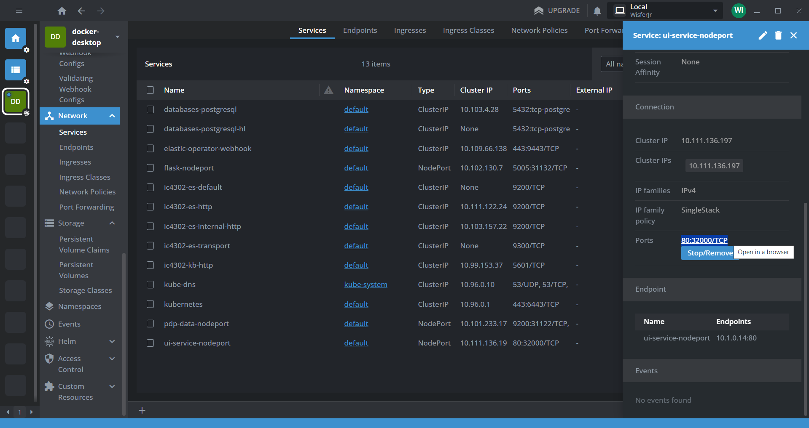

Una vez en el navegador, podemos apreciar la interfaz de usuario.

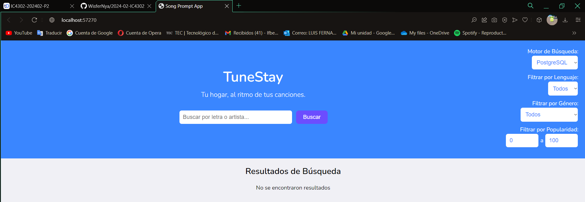

<div style="page-break-after: always;"></div>

## **Funcionalidades de la Aplicación**

### 1. Hacer una Búsqueda de Canciones

Podemos escribir en el campo que dice **Buscar por letra o artista...** cualquier prompt, y en la esquina superior derecha puedes seleccionar el motor de bases de datos, ya sea MongoDB o PostgreSQL.

**Búsqueda en PostgreSQL**


**Búsqueda en Mongo Atlas**
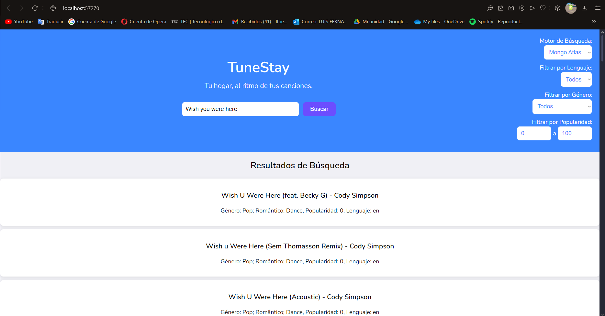

<div style="page-break-after: always;"></div>

### 2. Aplicar Filtros a la Búsqueda de Canciones

En el mismo área en la que elegimos el motor de bases de datos, podemos elegir los distintos filtros.


<div style="page-break-after: always;"></div>

### 3. Realizar una Búsqueda de Apartamentos

Una vez seleccionamos una canción, podremos ver la letra.

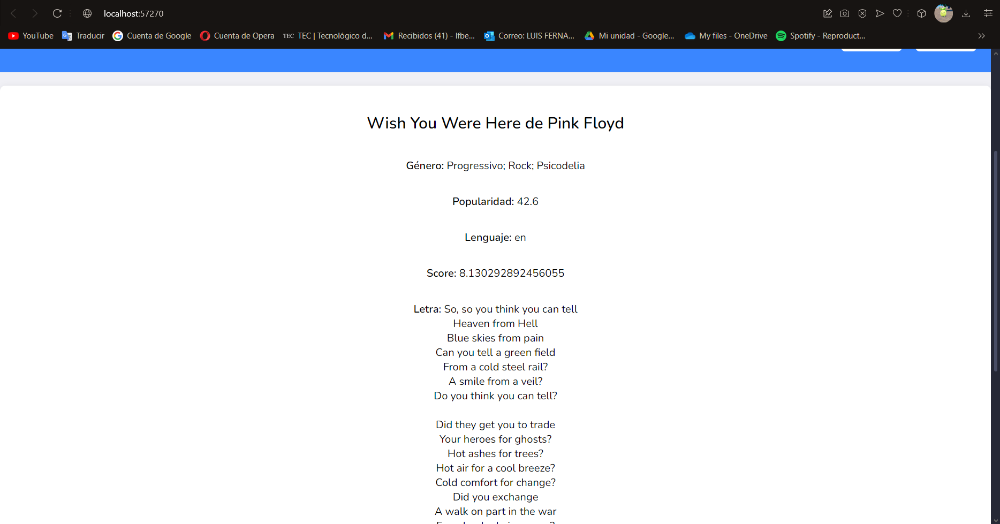

Y al seleccionar una sección de la letra, podemos copiarla y pegarla en el área de texto que sale abajo. Luego se presiona el botón que dice **Buscar apartamentos basados en la letra**


Esto nos mostrará una lista con todas las coincidencias de apartamentos. Podemos seleccionar uno de los elementos para ver su descripción larga y todas las reseñas que tiene.

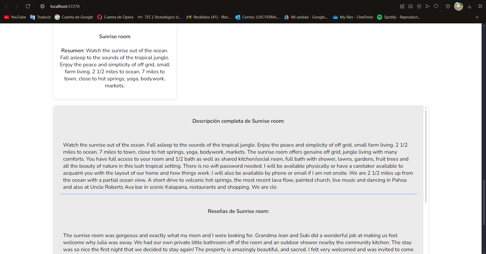

<div style="page-break-after: always;"></div>


## **Componentes de la Aplicación**

### Estructura del Proyecto

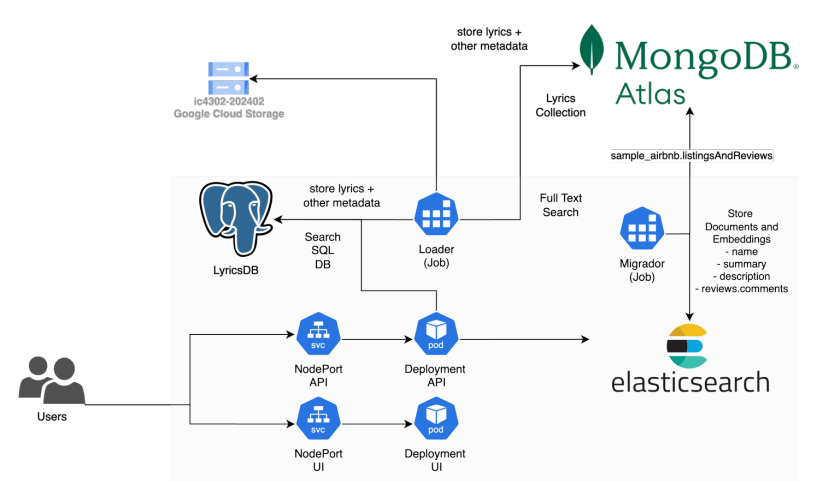
<div style="page-break-after: always;"></div>


### Loader

Este Job se ejecuta para las siguientes funciones:
1. Conectarse al Bucket de Google Cloud Storage y descargar los archivos de canciones y artistas del dataset.
2. Parsear los archivos multilínea e insertarlos en PostgreSQL y Mongo Atlas.

#### 1. Imports
```python
import os
import csv
from time import sleep
from google.cloud import storage
from pymongo import MongoClient
import pg8000
```

Se incluye las bibliotecas necesarias para conectar con las bases de datos (PostgreSQL y Mongo Atlas), descargar archivos desde el bucket de Google Cloud y procesar los datos CSV que se obtienen de él.

#### 2. Variables de Entorno
```python
XPATH = os.getenv('XPATH')
GOOGLE_APPLICATION_CREDENTIALS = os.getenv('GOOGLE_APPLICATION_CREDENTIALS')

POSTGRE_HOST = os.getenv('postgre_host')
POSTGRE_USER = os.getenv('postgre_user')
POSTGRE_PASSWORD = os.getenv('postgre_password')
POSTGRE_DBNAME = os.getenv('postgre_dbname')
POSTGRE_PORT = os.getenv('postgre_port')

MONGO_CLIENT = os.getenv('mongo_client')
```

Las variables de entorno se establecen en el archivo yaml del Job del Loader, e incluyen las credenciales para conectar con el servidor de PostgreSQL, la cadena de conexión con Mongo Atlas y la ruta para obtener el json con las credenciales de Google.


#### 3. Descargar Datos del Bucket
- Se encarga de descargar todos los archivos .csv desde un bucket de Google Cloud Storage a una carpeta local. 
- Se crea un cliente de Google Cloud Storage que accede al bucket proporcionado por su nombre. Luego, lista todos los archivos (blobs) en el bucket. 
- Revisa cada archivo en el bucket, si el archivo tiene una extensión .csv, se descarga en la ubicación de destino. Finalmente, cada archivo .csv se guarda en la carpeta o subcarpeta correspondiente.

```python
# Descargar archivos desde Google Cloud Storage
def download_files_from_gcs(bucket_name, destination_folder):
    # Crear cliente de Google Cloud Storage
    client = storage.Client()
    bucket = client.bucket(bucket_name)
    
    # Listar y descargar los archivos del bucket
    blobs = bucket.list_blobs()
    if not os.path.exists(destination_folder):
        os.makedirs(destination_folder)

    for blob in blobs:
        file_name = blob.name
        # Filtrar solo archivos .csv
        if not file_name.endswith('.csv'):
            print(f"Omitiendo archivo no relevante: {file_name}")
            continue

        destination_path = os.path.join(destination_folder, file_name)
        # Crear subdirectorios si no existen
        subdirectory = os.path.dirname(destination_path)
        if not os.path.exists(subdirectory):
            os.makedirs(subdirectory)

        print(f"Descargando {file_name} a {destination_path}")
        blob.download_to_filename(destination_path)
```

#### 4. Analizar los archivos CSV
Estas funciones se encargan de leer archivos .csv y convertirlos en estructuras de datos manejables en Python. `parse_csv_file` toma como entrada la ruta de un archivo .csv específico y devuelve una lista de diccionarios, donde cada diccionario representa una fila del archivo, con los nombres de columna como claves. `parse_csv_files_in_folder` procesa todos los archivos .csv en una carpeta.

```python
# Función para parsear un archivo CSV multilínea
def parse_csv_file(file_path):
    with open(file_path, mode='r', encoding='utf-8') as csvfile:
        reader = csv.DictReader(csvfile)
        data = [row for row in reader]
    return data

# Función para parsear todos los archivos .csv en una carpeta
def parse_csv_files_in_folder(folder_path):
    all_data = []
    for root, dirs, files in os.walk(folder_path):
        for file in files:
            if file.endswith('.csv'):
                file_path = os.path.join(root, file)
                print(f"Parseando archivo {file_path}")
                with open(file_path, mode='r', encoding='utf-8') as csvfile:
                    reader = csv.DictReader(csvfile)
                    for row in reader:
                        all_data.append(row)
    return all_data
```

#### 5. Insertar Canciones y Artistas en PostgreSQL
La función `insert_artist_into_postgres` agrega un artista a la base de datos PostgreSQL si no existe ya en la tabla Artists, usando el nombre o el enlace para evitar duplicados. Formatea el valor de popularidad y luego inserta los datos principales del artista.

La función `insert_song_into_postgres` inserta una canción si aún no está en la tabla Songs. Verifica primero si la canción ya existe y asocia el artist_id si el artista está en la base. Solo canciones con todos los datos requeridos (nombre, enlace, letra y lenguaje) se agregan a la base.

Ambas funciones validan que no se inserten filas si existe un dato faltante.

```python
# Insertar un artista en PostgreSQL
def insert_artist_into_postgres(artist, cursor):
    try:
        # Verificar si el artista ya existe por su nombre o enlace
        cursor.execute("SELECT artist_id FROM Artists WHERE artist_name = %s OR link = %s", 
                       (artist['Artist'], artist.get('Link')))
        artist_exists = cursor.fetchone()

        if artist_exists:
            print(f"Artista ya existente en PostgreSQL: {artist['Artist']}")
            return

        # Obtener y limpiar los datos de popularidad
        popularity = artist.get('Popularity')
        if popularity == 'NA' or not popularity:
            popularity = None
        else:
            popularity = float(popularity)  # Convertir a número decimal

        # Inserción en la tabla Artists
        cursor.execute(
            """
            INSERT INTO Artists (artist_name, genres, popularity, link)
            VALUES (%s, %s, %s, %s)
            """,
            (artist['Artist'], artist.get('Genres'), popularity, artist.get('Link'))
        )
        print(f"Artista insertado en PostgreSQL: {artist['Artist']}")

    except Exception as e:
        print(f"Error insertando artista en PostgreSQL {artist['Artist']} con datos: {artist}: {e}")
```
```python
# Insertar una canción en PostgreSQL
def insert_song_into_postgres(song, cursor):
    try:
        # Verificar si la canción ya existe por su enlace
        cursor.execute("SELECT song_id FROM Songs WHERE song_link = %s",
                       (song['SLink'],))
        song_exists = cursor.fetchone()

        if song_exists:
            print(f"Canción ya existente en PostgreSQL: {song['SName']}")
            return 

        # Verificar si hay un artista relacionado
        cursor.execute("SELECT artist_id FROM Artists WHERE link = %s", (song['ALink'],))
        artist_id = cursor.fetchone()

        # Si no hay artista, artist_id será None
        artist_id = artist_id[0] if artist_id else None

        # Manejo de valores nulos en los demás campos
        song_name = song.get('SName')
        song_link = song.get('SLink')
        lyric = song.get('Lyric')
        language = song.get('language')

        if not (song_name and song_link and lyric and language):
            print(f"Saltando canción con datos faltantes en PostgreSQL: {song_name}")
            return

        # Inserción en la tabla Songs
        cursor.execute(
            """
            INSERT INTO Songs (artist_id, song_name, song_link, lyric, language)
            VALUES (%s, %s, %s, %s, %s)
            """,
            (artist_id, song_name, song_link, lyric, language)
        )
        print(f"Canción insertada en PostgreSQL: {song_name}")

    except Exception as e:
        print(f"Error insertando canción en PostgreSQL {song['SName']}: {e}")
```

#### 6. Insertar Canciones y Artistas en Mongo Atlas
`insert_artist_into_mongodb` agrega un artista a la colección de Mongo Atlas, incluyendo las canciones asociadas a él. Crea un documento con el nombre del artista, géneros, popularidad, enlace y una lista de canciones, luego lo inserta en la colección especificada.

`insert_song_into_mongodb` crea un documento para una canción con su nombre, enlace, letra y lenguaje. Muestra un mensaje confirmando la inserción y devuelve el documento de la canción, que puede ser incluido en la lista de canciones de un artista en Mongo Atlas.

```python
# Insertar un artista en MongoDB
def insert_artist_into_mongodb(artist, songs, collection):
    try:
        # Crear el documento del artista con las canciones relacionadas
        document = {
            "artist": artist['Artist'],
            "genres": artist.get('Genres'),
            "popularity": artist.get('Popularity'),
            "link": artist.get('Link'),
            "songs": songs
        }

        # Insertar el documento en la colección de MongoDB
        collection.insert_one(document)
        print(f"Artista insertado en MongoDB: {artist['Artist']}")

    except Exception as e:
        print(f"Error insertando artista en MongoDB {artist['Artist']}: {e}")
```
```python
# Insertar una canción en MongoDB
def insert_song_into_mongodb(song):
    song_document = {
        "song_name": song['SName'],
        "song_link": song['SLink'],
        "lyric": song['Lyric'],
        "language": song['language']
    }
    print(f"Canción insertada en MongoDB: {song_document['song_name']}")  # Agregar el print aquí
    return song_document
```

#### 7. Insertar Artista por Artista en las Bases de Datos
Esta funcion primero crea las conexiones tanto con PostgreSQL como con Mongo Atlas, y luego realiza lo siguiente para cada artista en la lista de artistas:
1. Lo inserta si no existe en PostgreSQL.
2. Obtiene las canciones de este artista.
3. Inserta sus canciones en PostgreSQL.
4. Valida si existe en Mongo, si ya existe, solo salta al siguiente artista en la lista.
5. Si el artista no está, crea los documentos para cada cancion del artista.
6. Inserta el artista junto con todas sus canciones en Mongo Atlas.

```python
# Función que inserta los datos en ambas bases de datos
def insert_data(artists_data, lyrics_data):
    # Conectar a PostgreSQL
    connection = pg8000.connect(
        user=POSTGRE_USER,
        password=POSTGRE_PASSWORD,
        host=POSTGRE_HOST,
        port=POSTGRE_PORT,
        database=POSTGRE_DBNAME
    )
    cursor = connection.cursor()

    # Conectar a MongoDB
    client = MongoClient(MONGO_CLIENT,
                        tls=True,
                        tlsAllowInvalidCertificates=True
    )
    db = client['LyricsDB']
    collection = db['LyricsCollection']

    for artist in artists_data:
        print(f"\nSiguiente Artista: {artist['Artist']}")

        # Insertar artistas en PostgreSQL
        print("\nINSERTANDO ARTISTA EN PostgreSQL")
        insert_artist_into_postgres(artist, cursor)
        connection.commit()

        # Obtener canciones relacionadas con el artista
        related_songs = [
            song for song in lyrics_data if song['ALink'] == artist['Link']
        ]

        # Insertar canciones en PostgreSQL
        print("\nINSERTANDO CANCIONES EN PostgreSQL")
        for song in related_songs:
            if song.get('SName') and song.get('SLink') and song.get('Lyric') and song.get('language'):
                insert_song_into_postgres(song, cursor)
                connection.commit()
            else:
                print(f"Saltando canción con datos faltantes: {song.get('SName', 'Sin nombre')}")

        # Si el artista ya esta insertado en MongoDB, no se procesan las canciones ni el artista pq ya estan.
        artist_exists = collection.find_one({"artist": artist['Artist']})

        if artist_exists:
            print("\nOMITIENDO INSERCIÓN DE CANCIONES EN MongoDB.")
            print(f"Artista ya existente en MongoDB: {artist['Artist']}")
            continue

        # Crear canciones para MongoDB
        print("\nINSERTANDO CANCIONES EN MongoDB")
        artist_songs_mongo = []
        for song in related_songs:
            if song.get('SName') and song.get('SLink') and song.get('Lyric') and song.get('language'):
                artist_songs_mongo.append(insert_song_into_mongodb(song))
            else:
                print(f"Saltando canción con datos faltantes: {song.get('SName', 'Sin nombre')}")

        # Insertar el artista y sus canciones en MongoDB
        print("\nINSERTANDO ARTISTA EN MongoDB")
        if artist_songs_mongo:
            insert_artist_into_mongodb(artist, artist_songs_mongo, collection)

    cursor.close()
    connection.close()
```

#### 8. Ejecutar el Programa
`run_loader` ejecuta todas las funciones definidas anteriormente. Descarga las canciones y artistas del bucket, los da el formato para trabajarlos y los inserta en las bases de datos.

```python
# Función principal que ejecuta todo el proceso
def run_loader():
    bucket_name = "ic4302-202402"
    destination_folder = XPATH

    # Descargar archivos del bucket
    download_files_from_gcs(bucket_name, destination_folder)

    # Parsear archivo de artistas
    artists_data = parse_csv_file(os.path.join(destination_folder, 'artists-data.csv'))

    # Parsear todos los archivos en la carpeta 'lyrics/'
    lyrics_folder = os.path.join(destination_folder, 'lyrics')
    lyrics_data = parse_csv_files_in_folder(lyrics_folder)

    # Imprimir la cantidad de elementos en artists_data y lyrics_data
    print(f"Cantidad de artistas: {len(artists_data)}")
    print(f"Cantidad de canciones: {len(lyrics_data)}")

    # Insertar en PostgreSQL y MongoDB
    insert_data(artists_data, lyrics_data)

# Llamar a la función
if __name__ == "__main__":
    print("Ejecutando...")
    run_loader()
    print("\nProceso Finalizado")
```

<div style="page-break-after: always;"></div>


### Migrador

Este Job se ejecuta para las siguientes funciones:
1. Leer cada uno de los documentos en la colección de prueba llamada sample_airbnb.listingsAndReviews.
2. Calcula los embeddings usando los campos name, summary, description y reviews[*].comments.
3. Almacena los documentos.

#### 1. Imports
```python
import os
from pymongo import MongoClient
from elasticsearch import Elasticsearch
from sentence_transformers import SentenceTransformer
from bson.decimal128 import Decimal128
```

Se importa pymongo para hacer la conexion con Mongo Atlas y poder obtener los datos que hay en la colección de prueba, sentence transformers para generar los embeddings de los apartamentso y también elasticsearch para insertar los índices.

#### 2. Variables de Entorno
```python
MONGO_CLIENT = os.getenv('mongo_client')

ELASTIC_PASSWORD = os.getenv("ELASTIC_PASS")
ELASTIC_USER = os.getenv("ELASTIC_USER")
ELASTIC_SERVICE = os.getenv("ELASTIC")
ELASTIC_PORT = os.getenv("ELASTIC_PORT")
es_url = f"http://{ELASTIC_SERVICE}:{ELASTIC_PORT}"
```

Se obtiene la cadena de conexión a la base de datos en Mongo Atlas y las credenciales de ElasticSearch desde variables de entorno.

#### 3. Leer Documentos Desde Mongo Atlas
La función `read_documents_from_mongodb` se encarga de conectar a una base de datos MongoDB y leer todos los documentos de la colección listingsAndReviews dentro de la base de datos sample_airbnb. 
- Crea un cliente de MongoDB y accede a la base de datos y la colección especificadas. 
- Utiliza el método find para recuperar todos los documentos de la colección, convirtiéndolos en una lista.
- Los retorna

```python
# 1. Conectar a MongoDB y leer los documentos de sample_airbnb.listingsAndReviews
def read_documents_from_mongodb():
    print(f"Conectando a MongoDB con la cadena de conexión: {MONGO_CLIENT}")
    client = MongoClient(MONGO_CLIENT)
    db = client['sample_airbnb']
    collection = db['listingsAndReviews']
    
    # Leer todos los documentos de la colección
    documents = list(collection.find({}))
    print(f"Se han leído {len(documents)} documentos desde MongoDB")
    return documents
```

#### 4. Calcular Embeddings para un Documento
La función `calculate_embedding_for_document` se encarga de calcular un embedding para un documento específico utilizando un modelo de SentenceTransformer. 
- Construye una cadena de texto combinando los campos name, summary y description del documento, y también concatena los comentarios de las reseñas si hay. 
- Una vez que tiene el texto completo, utiliza el modelo de SentenceTransformer para calcular el embedding, que es una representación vectorial del texto. Este embedding se convierte en una lista para poder ser almacenado en formato JSON y se agrega al documento original bajo la clave embedding. 
- Devuelve el documento actualizado con el nuevo campo.

```python
# 2. Calcular el embedding de un solo documento usando SentenceTransformer
def calculate_embedding_for_document(doc, embedding_model):
    text_to_embed = f"{doc.get('name', '')} {doc.get('summary', '')} {doc.get('description', '')}"

    # Concatenar comentarios de reviews si existen
    reviews = doc.get('reviews', [])
    comments = " ".join([review.get('comments', '') for review in reviews])
    text_to_embed += f" {comments}"

    # Calcular embedding usando el modelo de SentenceTransformer
    embedding = embedding_model.encode(text_to_embed)
    
    # Guardar el embedding en el documento
    doc['embedding'] = embedding.tolist()  # Convertir a lista para JSON
    print(f"Embedding calculado para el documento {doc.get('_id')}")

    return doc
```

#### 5. Almacenar un Documento en ElasticSearch
La función `store_document_in_elasticsearch` se encarga de almacenar un documento en Elasticsearch. 
- Extrae el campo _id del documento y lo convierte a una cadena, eliminándolo del documento para evitar conflictos. 
- Utiliza la función convert_decimal128_to_float para transformar los valores de tipo Decimal128 en números de punto flotante, asegurando que los datos sean compatibles con Elasticsearch. 
- Filtra el documento para conservar solo los campos necesarios: name, summary, description y reviews.comments y embedding. 
- Antes de realizar la inserción, verifica si el documento ya existe en Elasticsearch utilizando su ID

```python
# 3. Almacenar un solo documento en Elasticsearch
def store_document_in_elasticsearch(doc, es):
    # Extraer el campo _id y eliminarlo del documento
    document_id = str(doc.pop('_id'))

    # Convertir Decimal128 a float en el documento antes de almacenarlo
    doc = convert_decimal128_to_float(doc)

    # Filtrar el documento para conservar solo los campos necesarios
    filtered_doc = {
        "name": doc.get("name"),
        "summary": doc.get("summary"),
        "description": doc.get("description"),
        "reviews": [{"comments": review.get("comments")} for review in doc.get("reviews", [])],
        "embedding": doc.get("embedding")
    }

    # Verificar si el documento ya existe en Elasticsearch
    if es.exists(index="listings_and_reviews", id=document_id):
        print(f"Documento {document_id} ya existe en Elasticsearch, omitiendo inserción.")
    else:
        # Insertar el documento si no existe
        es.index(index="listings_and_reviews", id=document_id, body=filtered_doc)
        print(f"Documento {document_id} almacenado en Elasticsearch")
```

#### 6. Crear el índice en ElasticSearch
La función `create_elasticsearch_index` crea un índice en Elasticsearch con una estructura de mapeo específica. 
- Define un diccionario con el mapping que especifica los tipos de datos para los diferentes campos que se almacenarán en el índice: name, summary, description, y reviews (que es un campo anidado conteniendo comentarios). 
- También define embedding como un vector denso de 768 dimensiones, optimizado para búsquedas de similitud mediante el uso de la métrica de similitud coseno. 
- Luego, verifica si el índice listings_and_reviews ya existe.

```python
# 4. Crear el índice en Elasticsearch con el mapeo adecuado
def create_elasticsearch_index(es):
    mapping = {
        "mappings": {
            "properties": {
                "name": {
                    "type": "text"
                },
                "summary": {
                    "type": "text"
                },
                "description": {
                    "type": "text"
                },
                "reviews": {
                    "type": "nested",
                    "properties": {
                        "comments": {
                            "type": "text"
                        }
                    }
                },
                "embedding": {
                    "type": "dense_vector", 
                    "dims": 768, 
                    "index": True,
                    "similarity": "cosine"
                }
            }
        }
    }

    # Verificar si el índice ya existe, y crearlo si no
    if not es.indices.exists(index="listings_and_reviews"):
        es.indices.create(index="listings_and_reviews", body=mapping)
        print("Índice 'listings_and_reviews' creado en Elasticsearch")
    else:
        print("Índice 'listings_and_reviews' ya existe en Elasticsearch, no se crea uno nuevo.")
```


#### 7. Ejecutar el Programa
La función `run_migrador` es la función principal del programa ya qje coordina el flujo general del proceso de migración de datos desde MongoDB a Elasticsearch. 
- Se conecta a la base de datos Mongo y se obtienen los documentos. 
- Se inicializa un modelo de embeddings de texto con SentenceTransformer, que se utilizará para generar representaciones vectoriales de los documentos. 
- Se establece una conexión a Elasticsearch y crea el indice. 
- Itera sobre cada documento encontrado, calcula su embedding con los campos solicitados y luego almacena los campos solicitados de documento en Elasticsearch. 

```python
# Función principal
def run_migrador():
    # Leer documentos de MongoDB
    documents = read_documents_from_mongodb()

    # Inicializar el modelo de embeddings
    embedding_model = SentenceTransformer('all-mpnet-base-v2')

    # Conectar a Elasticsearch
    es = Elasticsearch(es_url, basic_auth=(ELASTIC_USER, ELASTIC_PASSWORD))
    print(f"Conectado a Elasticsearch en la URL: {es_url}")

    # Crear el índice con el mapeo adecuado
    create_elasticsearch_index(es)

    # Procesar cada documento individualmente
    for doc in documents:
        # Calcular embedding para el documento
        doc_with_embedding = calculate_embedding_for_document(doc, embedding_model)

        # Almacenar el documento en Elasticsearch
        store_document_in_elasticsearch(doc_with_embedding, es)

        print("\n")

# Ejecutar el migrador
if __name__ == "__main__":
    print("Ejecutando...")
    run_migrador()
    print("\nProceso Finalizado")
```


<div style="page-break-after: always;"></div>


### API

Esta API tiene los enpoints necesarios para el funcionamiento de la interfaz de usuario. Se ejecuta como un Deployment.

#### 1. Imports
```python
import os
from pymongo import MongoClient
from elasticsearch import Elasticsearch
import pg8000
from flask import Flask, jsonify, request
from flask_cors import CORS
from sentence_transformers import SentenceTransformer
```

Se hacen los imports para manejar las bases de datos que utiliza el proyecto, para definir los endpoints y manejar las solicitudes HTTP y para generar los embeddings de las canciones para compararlas con los apartamentos.

#### 2. Variables de Entorno
```python
POSTGRE_HOST = os.getenv('postgre_host')
POSTGRE_USER = os.getenv('postgre_user')
POSTGRE_PASSWORD = os.getenv('postgre_password')
POSTGRE_DBNAME = os.getenv('postgre_dbname')
POSTGRE_PORT = os.getenv('postgre_port')

MONGO_CLIENT = os.getenv('mongo_client')

ELASTIC_PASSWORD = os.getenv("ELASTIC_PASS")
ELASTIC_USER = os.getenv("ELASTIC_USER")
ELASTIC_SERVICE = os.getenv("ELASTIC")
ELASTIC_PORT = os.getenv("ELASTIC_PORT")
es_url = f"http://{ELASTIC_SERVICE}:{ELASTIC_PORT}"
```

Las variables de entorno que se emplean en este programa son para hacer las conexiones a PostgreSQL, Mongo Atlas y ElasticSearch.

#### 3. Configuraciones
```python
# Cargar el modelo de embeddings
embedding_model = SentenceTransformer('all-mpnet-base-v2')


# Conexión a PostgreSQL
def get_postgres_connection():
    return pg8000.connect(
            user=POSTGRE_USER,
            password=POSTGRE_PASSWORD,
            host=POSTGRE_HOST,
            port=POSTGRE_PORT,
            database=POSTGRE_DBNAME
        )

# Conexión a MongoDB
mongo_client = MongoClient(
            MONGO_CLIENT,
            tls=True,
            tlsAllowInvalidCertificates=True
        )
mongo_db = mongo_client['LyricsDB']
lyrics_collection = mongo_db['LyricsCollection']

# Conexión a Elasticsearch
es = Elasticsearch(es_url, basic_auth=(ELASTIC_USER, ELASTIC_PASSWORD))


# Flask
app = Flask(__name__)
CORS(app, resources={r"/*": {"origins": "*"}})
```

En esta sección solo se carga el modelo de embeddings, se crean las conexiones con las bases de datos y se crear el Flask.

#### 4. Endpoint /search

En este endpoint se hacen las busquedas de canciones en las bases de datos. No importa cuál de las dos bases de datos se seleccione, está diseñado de manera que ambas retornan sus resultados con la misma estructura.   
La que tiene tiempos de respuesta más rápidos es Mongo Atlas, y la forma que se utiliza para hacer el **ranking por relevancia** de los resultados es mediante que tan similar fue el query que el usuario le dio con los campos de la cancion. Más adelante, se explica más a detalle como funciona este ranking en cada base de datos.

```python
# Endpoint para búsqueda general en MongoDB o PostgreSQL
@app.route("/search", methods=["POST"])
def search():
    data = request.get_json()
    query = data.get("query")
    database = data.get("database")
```

En esta sección, se define el endpoint /search, que responde a solicitudes POST. Recibe los datos de la solicitud en formato JSON y extrae los parámetros query, que contiene el término de búsqueda, y database, que indica si la búsqueda debe realizarse en MongoDB o PostgreSQL.

```python
    if database == "mongo":
        # Realizar búsqueda en MongoDB usando el pipeline de búsqueda
        search_pipeline = [
            {
                "$search": {
                    "index": "default",  # Nombre del índice de búsqueda
                    "text": {
                        "query": query,
                        "path": ["artist", "genres", "songs.song_name", "songs.lyric", "songs.language", "popularity"]  
                    }
                }
            },
            {
                "$project": {
                    "artist": 1,
                    "genres": 1,
                    "popularity": 1,
                    "link": 1,  # Incluir el enlace del artista
                    "score": {"$meta": "searchScore"},  # Relevancia de la búsqueda
                    "matching_songs": {
                        "$filter": {
                            "input": "$songs",
                            "as": "song",
                            "cond": {
                                "$or": [
                                    {"$regexMatch": {"input": "$$song.song_name", "regex": query, "options": "i"}},
                                    {"$regexMatch": {"input": "$$song.lyric", "regex": query, "options": "i"}}
                                ]
                            }
                        }
                    }
                }
            },
            {
                "$match": {
                    "matching_songs": {"$ne": []}  # Filtrar documentos sin canciones coincidentes
                }
            }
        ]

        results = list(lyrics_collection.aggregate(search_pipeline))

        # Procesar los resultados
        processed_results = []
        for doc in results:
            artist = doc['artist']
            genres = doc['genres']
            popularity = doc['popularity']
            artist_link = doc['link']  # Link del artista
            score = doc['score']
            for song in doc['matching_songs']:
                processed_results.append({
                    "artist": artist,
                    "genres": genres,
                    "song_name": song['song_name'],
                    "lyric": song['lyric'],
                    "language": song.get('language', "Unknown Language"),
                    "popularity": popularity,
                    "artist_link": artist_link,  # Añadir link del artista
                    "song_link": song['song_link'],  # Añadir link de la canción
                    "score": score  # Relevancia de la búsqueda
                })

        results = processed_results
```

En esta sección, si el parámetro database es **"mongo"**, se ejecuta una búsqueda en MongoDB utilizando un pipeline de agregación.  
- El primer paso del pipeline es el operador $search, que permite hacer búsquedas de texto completo utilizando un índice de búsqueda específico. Este operador busca coincidencias exactas y similares entre los campos y la consulta proporcionada por el usuario. 

- A continuación, el operador $project se utiliza para definir qué campos incluir en los resultados. Además, se **calcula el score**, que representa la relevancia de cada documento respecto a la consulta, utilizando {"$meta": "searchScore"}.

- Posteriormente, el operador $filter se emplea para filtrar las canciones que coinciden con la consulta en sus títulos o letras. 

- El operador $match se utiliza para excluir documentos que no tienen canciones que coinciden con la búsqueda.

- Después de ejecutar el pipeline, los resultados se procesan y se estructuran en un formato que incluye todos los campos necesarios, listos para ser devueltos al usuario.

```python
    elif database == "postgres":
        # Realizar búsqueda en PostgreSQL
        connection = get_postgres_connection()
        cursor = connection.cursor()

        cursor.execute("""
            SELECT a.artist_name, a.genres, a.popularity, a.link AS artist_link, s.song_name, s.song_link, s.lyric, s.language, 
                ts_rank(to_tsvector(s.lyric), plainto_tsquery(%s)) AS rank 
            FROM Songs s 
            JOIN Artists a ON s.artist_id = a.artist_id 
            WHERE a.artist_name ILIKE %s OR s.lyric ILIKE %s 
            ORDER BY rank DESC 
        """, (query, f'%{query}%', f'%{query}%'))
        
        # Procesar los resultados para que coincidan con el formato de MongoDB
        results = []
        for row in cursor.fetchall():
            results.append({
                "artist": row[0],
                "genres": row[1],
                "song_name": row[4],
                "lyric": row[6],
                "language": row[7],
                "popularity": row[2],
                "artist_link": row[3],
                "song_link": row[5],
                "score": row[8]
            })

        cursor.close()
        connection.close()
```

Si el parámetro database es **"postgres"**, se establece una conexión a PostgreSQL y se ejecuta una consulta SQL para buscar canciones y artistas. 
- Primero, se establece una conexión a la base de datos y se crea un cursor para ejecutar la consulta. En esta consulta, se seleccionan el nombre del artista, géneros, popularidad, enlaces, letras e idioma de las canciones, así como el ranking de relevancia.

- Se utiliza la función ts_rank para calcular una **puntuación de relevancia** que indica que tanto la letra de la canción coincide con una consulta de texto dada. Se utiliza to_tsvector para transformar la letra en un vector de texto y plainto_tsquery para generar un texto plano para la consulta, a partir del query del usuario.  
El resultado es un valor numérico que representa la importancia del documento, cuanto más alto sea el valor devuelto por ts_rank, más relevante es el resultado de la consulta. Esto permite a los usuarios ordenar los resultados según su relevancia.

- El operador ILIKE permite realizar búsquedas insensibles a mayúsculas y minúsculas de el query que da el usuario, comparandolo con el nombre del artista y con la letra.

- Después de ejecutar la consulta, los resultados se procesan para que coincidan con el formato utilizado en MongoDB y se cierran el cursor y la conexión a la base de datos.


```python
    else:
        return jsonify({"error": "Especifique una base de datos válida"}), 400

    return jsonify(results)
```

 - Si el valor de database no es ni "mongo" ni "postgres", se devuelve un error JSON con un mensaje que indica que se debe especificar una base de datos válida. 
 - Finalmente, si la búsqueda fue exitosa en alguna de las bases de datos, se devuelven los resultados en formato JSON.

#### 5. Endpoint /apartment/search
Buscar apartamentos similares en el índice de Elasticsearch, utilizando embeddings generados a partir de un texto proporcionado por el usuario. 
- Se extrae el campo selected_text del cuerpo de la solicitud en formato JSON. 
- Se generan embeddings para el texto utilizando el modelo, convirtiendo el texto en un vector numérico que captura su significado semántico. 
- Se construye una consulta KNN para buscar apartamentos similares en Elasticsearch, especificando el campo embedding, el vector de consulta, y configurando el número de resultados a devolver (k) y los candidatos a considerar (num_candidates). 
- Después de ejecutar la búsqueda en el índice listings_and_reviews, se procesan los resultados, extrayendo información relevante como el nombre, resumen, descripción y comentarios de las reseñas de cada apartamento.
- Finalmente se devuelven como respuesta en formato JSON.

```python
# Endpoint para convertir texto en embeddings y buscar apartamentos similares en Elasticsearch
@app.route("/apartment/search", methods=["POST"])
def apartment_search():
    data = request.get_json()
    selected_text = data.get("selected_text")
    if not selected_text:
        return jsonify({"error": "El campo 'selected_text' es requerido"}), 400

    embeddings = embedding_model.encode(selected_text).tolist()

    query = {
        "knn": {
            "field": "embedding",
            "query_vector": embeddings,
            "k": 10,
            "num_candidates": 50
        }
    }

    response = es.search(index="listings_and_reviews", body=query)

    results = []
    for hit in response['hits']['hits']:
        name = hit['_source'].get('name', 'Unknown Apartment')
        summary = hit['_source'].get('summary', 'No summary available')
        description = hit['_source'].get('description', 'No description available')
        reviews = hit['_source'].get('reviews', [])

        # Procesar los comentarios en 'reviews'
        reviews_list = [review.get("comments", "") for review in reviews]

        # Agregar el resultado a la lista
        results.append({
            "name": name,
            "summary": summary,
            "description": description,
            "reviews": reviews_list
        })

    return jsonify(results)
```

#### 6. Endpoint /distinct
Obtiene todos los géneros musicales y lenguajes únicos presentes en la colección de letras de canciones almacenadas en Mongo Atlas. La interfaz gráfica requiere de este endpoint para cargarlos para ser usados como filtros. Se eligió usar Mongo ya que es más rápida y tiene los mismos datos que hay en Postgre.
- La función inicia obteniendo todos los géneros únicos de la colección utilizando el método distinct en el campo "genres". Los géneros se separan y se añaden a un conjunto para garantizar que no haya duplicados y luego se tranforman en una lista.
- Luego, la función obtiene los lenguajes únicos en el campo "songs.language" de la misma manera, filtrando los resultados para incluir solo idiomas validos. 
- Los géneros y lenguajes distintos se estructuran en un diccionario y se devuelven en formato JSON como respuesta al usuario, permitiendo que la aplicación cliente acceda fácilmente a esta información.

```python
# Endpoint para obtener todos los géneros y lenguajes distintos
@app.route("/distinct", methods=["GET"])
def distinct_fields():
    # Obtener todos los géneros únicos
    genres_result_temp = lyrics_collection.distinct("genres")

    generos_unicos = set()

    # Separar los géneros y agregarlos al conjunto
    for genero in genres_result_temp:
        generos_separados = genero.split('; ')
        for g in generos_separados:
            generos_unicos.add(g.strip())  # Usar strip() para eliminar espacios en blanco

    # Convertir el conjunto de vuelta a una lista (opcional)
    genres_result = list(generos_unicos)

    # Obtener todos los lenguajes únicos
    languages_result_temp = lyrics_collection.distinct("songs.language")

    languages_result = []
    for lang in languages_result_temp:
        if(len(lang)==2):
            languages_result.append(lang)

    # Estructurar el resultado
    result = {
        "distinct_genres": genres_result,
        "distinct_languages": languages_result
    }

    return jsonify(result)
```

#### 7. Ejecutar la API de Flask
Se ejecuta la API en el puerto 5005 para que la UI pueda acceder.

```python
if __name__ == "__main__":
    app.run(host="0.0.0.0", port=5005)
    print("Terminando API...")
```

<div style="page-break-after: always;"></div>


### UI

La UI es una interfaz web, implementada con react, sencilla que nos permitira hacer las consultas las bases de datos de una manera visual y mas intuitiva.

#### AA

<div style="page-break-after: always;"></div>


### Bases de Datos


- #### **PostgreSQL**
Diagrama Relacional de la base de datos LyricsDB.
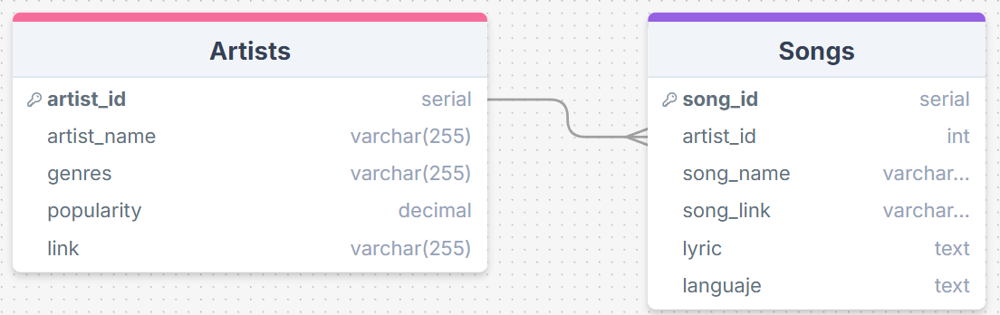
<div style="page-break-after: always;"></div>


- #### **MongoDB**
TODO
<div style="page-break-after: always;"></div>


- #### **ElasticSearch**
Documentación del mapping del índice listings_and_reviews de Elasticsearch:
```json
{
    "mappings": {
        "properties": {
            "name": {
                "type": "text"
            },
            "summary": {
                "type": "text"
            },
            "description": {
                "type": "text"
            },
            "reviews": {
                "type": "nested",
                "properties": {
                    "comments": {
                        "type": "text"
                    }
                }
            },
            "embedding": {
                "type": "dense_vector", 
                "dims": 768, 
                "index": True,
                "similarity": "cosine"
            }
        }
    }
}
```

<div style="page-break-after: always;"></div>


## **Pruebas Realizadas**

Revisión de pods para verificar si están funcionando correctamente. Además, para probar los diferentes componentes se tienen dos tipos de prueba, estos son: pruebas con Postman u otro servicio para revisar si las rutas estan funcionando correctamente en el caso de la API escrita en Python con Flask y pruebas unitarias en el caso del API, el Loader y el Migrador. Además, se mostraron pruebas utilizando la UI creada para el proyecto.

Para las pruebas unitarias solamente se necesesita ejecutar el proyecto y luego revisar en la consola al ejecutar el comando de *build.sh* si las pruebas tuvieron exito. Esto se verá parte por partes en el siguiente apartado donde se mostraran los resultados de las pruebas unitarias.

## **Resultados de las Pruebas Realizadas**

Se realizaron pruebas unitarias para la API, el Loader y el Migrador. Los resultados de cada una de las pruebas se mostraran al ejecutar **build.sh**. 
Para las pruebas unitarias, se utilizó la librería de unittest que viene incluida en las versiones más recientes de python. En caso de que las pruebas sean existosas en los logs del pods debería aparecer "RAN {numero_de_tests} in {tiempo_de_ejecución}" y luego un "OK". En caso contrario en lugar del "OK", aparece FAILED (failures={numero_de_fails}) e indica en que linea falló y que tipo de error ocurrió.  
En las siguientes imagenes, están los resultado de las pruebas unitarias de cada uno de los componentes. Asimismo, se utilizó el módulo **mock** de la librería de unittest para simular objetos, servicios externos y partes de las funciones.  

### API
En este módulo se probaron 4 endpoints. Los endpoints que se probaron son **/search**, **/apartment/search** y **/distinct**. Además se realizó una prueba unitaria para la función de 'encode' que sirve para generar un embedding. Para esta parte se realizaron un total de 5 pruebas y todas dieron como resultado 'OK' indicando que las pruebas tuvieron exito. Son 5 pruebas ya que para la función de prueba para el endpoint de **/search** se necesitaba demostrar que funcionaba tanto con MongoDB como con PostgreSQL. Asimismo, para mantener el orden, en el archivo de unitTests.py dentro de la carpeta /api/app se creo una clase que contiene las funciones relacionadas con la busqueda de canciones y la función de encode y otra para la función relacionada a los apartamentos. A continuación se muestra una imagen del texto que debería salir en pantalla una vez ejecutado el proyecto donde lo primero que se muestra son los tests del API.  
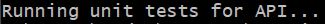  
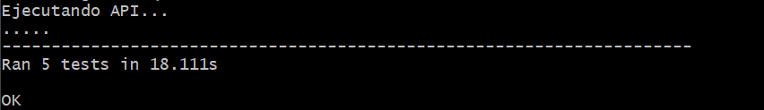

### Loader
Los distintos mensajes que salen en la imagen son logs para verificar que ciertas partes de algunas funciones se esten ejecutando correctamente. Para estas pruebas unitarias se tiene una clase para las funciones de inserción y otra para las demás. Asimismo, la función para la inserción de artistas ubicada en este módulo cuentan con varios unit tests para verificar distintos casos. Estos casos son: insertar un artista nuevo e insertar un artista existente.  
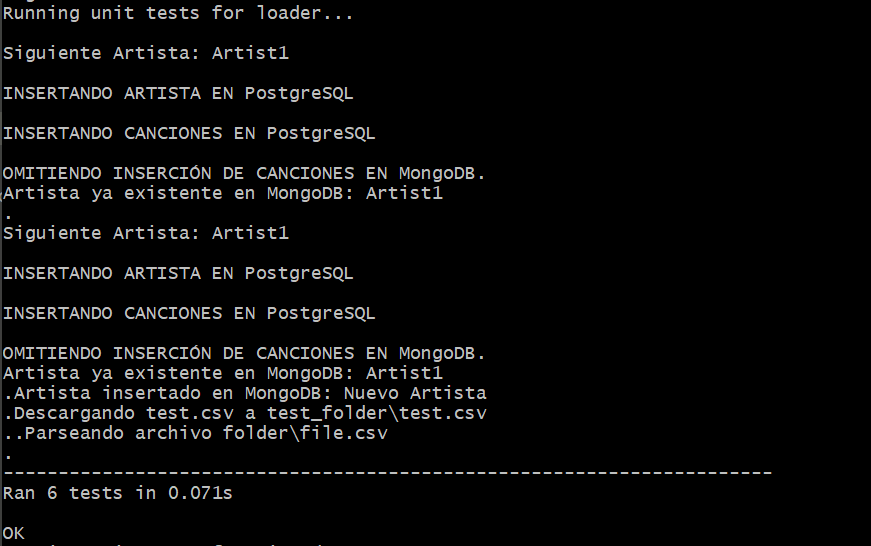

### Migrador
Para el Migrador solamente hay cuatro funciones principales **(read_documents_from_mongodb(), calculate_embedding_for_document, store_document_in_elasticsearch y create_elasticsearch_index)** por lo tanto se tiene una prueba para cada función. Para hacer estas pruebas se simularon los servicios de Mongo y los de ElasticSearch.  
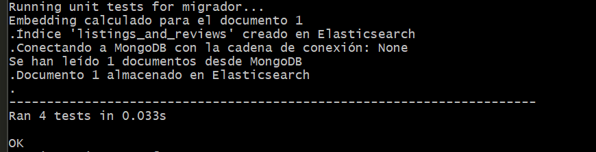

<div style="page-break-after: always;"></div>


## **Recomendaciones y Conclusiones**

### Recomendaciones

<div style="page-break-after: always;"></div>

### Conclusiones

<div style="page-break-after: always;"></div>