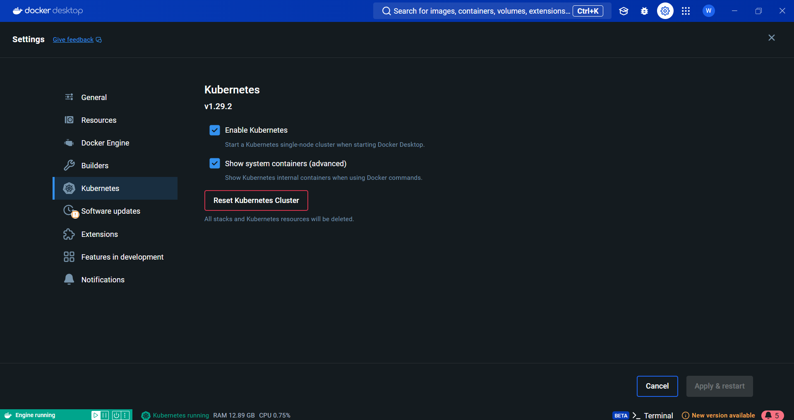
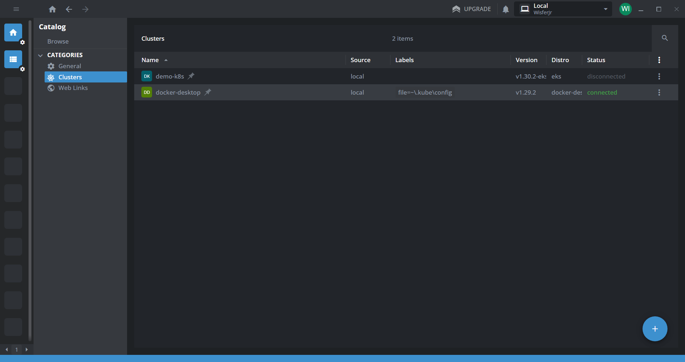
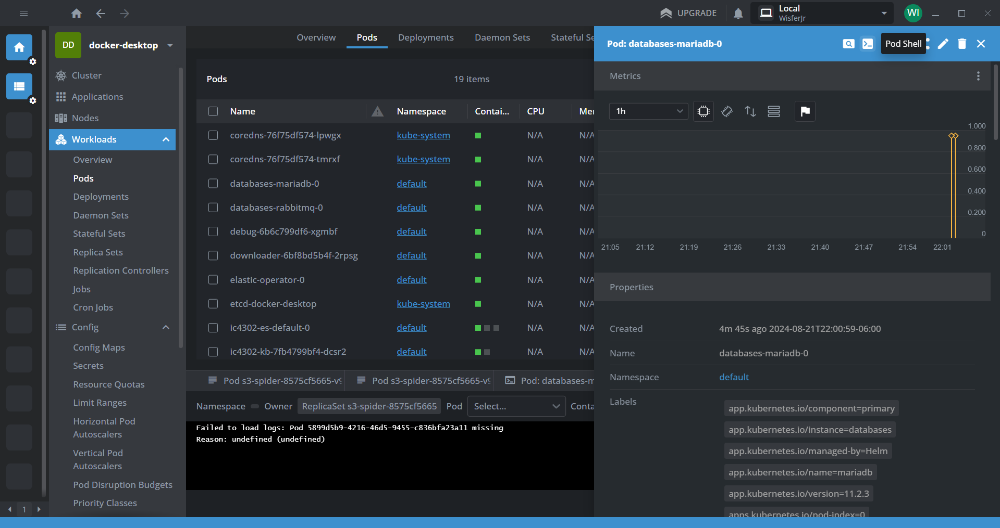
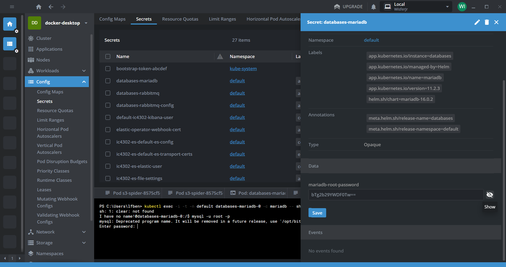
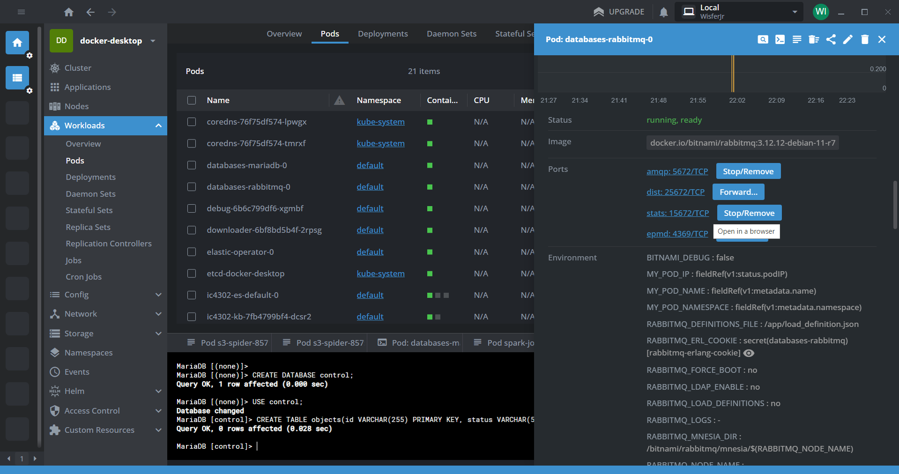
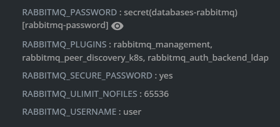
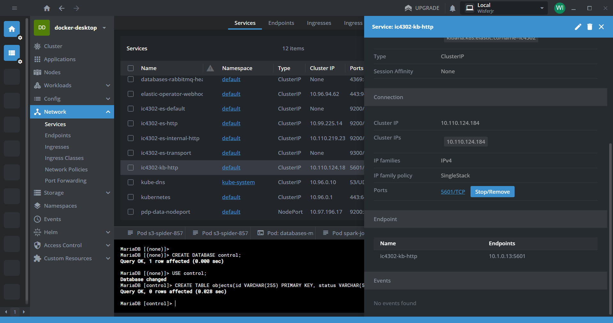
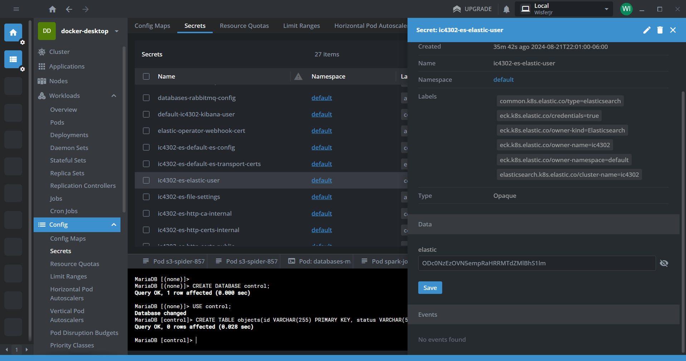
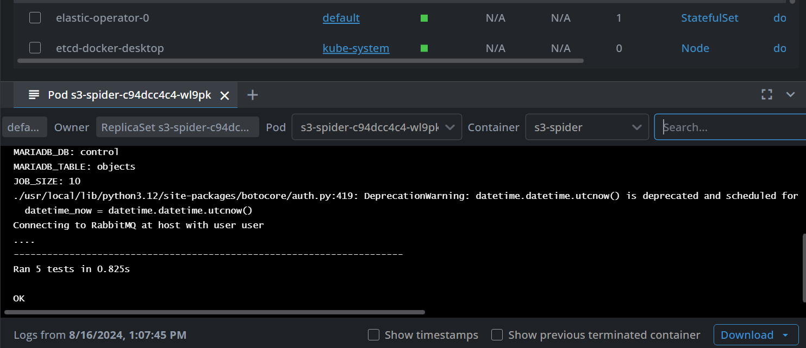

# Documentación del Proyecto Opcional

Andrés Bonilla Solano - 2023101220  
Luis Fernando Benavides Villegas - 2023072689  
Juan Diego Jiménez - 2019199111  
Alex Naranjo - 2023063599 

## **Instrucciones para ejecutar el proyecto:**

### 1. Instalación y configuración de Docker

* Crear un usuario de [DockerHub](https://hub.docker.com/).
* Instalar [Docker Desktop](https://docs.docker.com/desktop/install/windows-install/).
* Una vez instalado, iniciar sesión y en **Settings > Kubernetes** activar la casilla de Habilitar Kubernetes.



### 2. Otras instalaciones

* Instalar [Kubectl](https://kubernetes.io/docs/tasks/tools/install-kubectl-macos/).
* Instalar [Helm](https://helm.sh/docs/intro/install/).
* Instalar [Lens](https://k8slens.dev/).
* Instalar [Visual Studio Code](https://code.visualstudio.com/).

### 3. Hacer el build de las imágenes de docker

En una terminal de bash correr las siguientes líneas:
Recordar cambiar donde dice **user** con su usuario de DockerHub.

```bash
cd ./PO/docker
./build.sh user
```

### 4. Configurar y hacer el install

Antes de comenzar con el install es necesario modificar el usuario de DockerHub
* Buscar en el proyecto **PO/charts/application/values.yaml**.
* Una vez dentro, en las primeras líneas de código hay que reemplazar el usuario con su usuario de DockerHub.

```yaml
config:
 docker_registry: user
```

Una vez hecho este cambio, se ejecuta el install en una terminal de bash:

```bash
cd ./PO/charts
./install.sh
```

Para hacer la desinstalación, puede ejecutar:

```bash
cd ./PO/charts
./uninstall.sh
```

### 5. Crear la base de datos de MariaDB

Entrar a **Lens** y buscar en **Catálogo > Categorías > Clusters** y entrar al que se llama **docker-desktop**



Una vez dentro, ir a **Workloads > Pods** y seleccionar el pod que se llama **databases-mariadb-0**. En el menu abrir la terminal en la opción **Pod Shell**



Aquí, vamos a correr las siguientes líneas de código:

```
mysql -u root -p
```

Nos va a pedir una contraseña. Esta la vamos a encontrar buscando en la sección **Config > Secrets**, donde vamos a seleccionar **databases-mariadb** y buscar el campo donde dice **mariadb-root-password**. Hay que darle al botón de show para revelar la contraseña, y escribirla en la terminal.



En la terminal que abrimos luego de ingresar la contraseña corremos los siguientes querys:

```sql
CREATE DATABASE control;

USE control;

CREATE TABLE objects(
    id VARCHAR(255) PRIMARY KEY,
    status VARCHAR(50),
    dois TEXT,
    omitted TEXT,
    fecha_inicio DATETIME,
    fecha_fin DATETIME
);
```

### 6. Visualizar la cola de RabbitMQ

Vamos a buscar en los pods, el que se llama **databases-rabbitmq-0**. En el menú, bajando un poco se encuentra la opción de **Ports**. Podemos seleccionar el que dice **stats** para visualizar la información de la cola de RabbitMQ.



Una vez en el navegador, pedirá un usuario y una contraseña. Estas las encontramos bajando un poco más en las **variables de entorno**.



### 7. Visualizar la base de datos de ElasticSearch con Kibana

Para visualizar la base de datos de ElasticSearch, vamos a buscar en **Network > Services** el servicio llamado **ic4302-kb-http**. En el menú, bajamos hasta encontrar la opción de **Ports**, le damos click y nos lo abrirá en el navegador.



Solicitará un usuario y una contraseña. El usuario es **elastic** y la contraseña la podemos encontrar en **Config > Secrets**, en el que se llama **ic4302-es-elastic-user**. Bajamos a la sección **Data** y copiamos la contraseña.



### 8. Consultas para Kibana

A continuación, se describen diferentes consultas realizadas en Kibana utilizando Elasticsearch.

#### 1. Listar Índices Disponibles

```bash
GET /_cat/indices?v
```

Este query lista todos los índices disponibles en el clúster de Elasticsearch. El parámetro `v` agrega encabezados a la tabla de resultados para que la información sea más legible. La salida muestra detalles como el nombre del índice, número de documentos, tamaño del índice, entre otros.

#### 2. Obtener un Documento del Índice `data`

```json
GET /data/_search
{
  "size": 1,
  "query": {
    "match_all": {}
  }
}
```

Este query busca en el índice `data` y devuelve un solo documento (`size: 1`). La consulta `match_all` selecciona todos los documentos en el índice, por lo que se obtiene uno de ellos. Este tipo de consulta es útil para verificar que existen documentos en el índice o para inspeccionar un ejemplo de los datos.

#### 3. Buscar Documentos por Autor y Rango de Fechas

```json
GET /data/_search
{
  "query": {
    "bool": {
      "must": [
        {
          "match": {
            "message.author_names": "Smith"
          }
        },
        {
          "range": {
            "message.published.date": {
              "gte": "2000-01-01",
              "lte": "2020-12-31"
            }
          }
        }
      ]
    }
  },
  "size": 5,
  "_source": ["message.indexed.date", "message.created.date", "message.published.date", "message.author_names", "message.reference_title"]
}
```

Este query busca documentos en el índice `data` que cumplan con dos condiciones (`must`):
1. **Autor**: El campo `message.author_names` debe contener el nombre "Smith".
2. **Fecha de Publicación**: El campo `message.published.date` debe estar entre el 1 de enero de 2000 y el 31 de diciembre de 2020.

El resultado devuelve un máximo de 5 documentos (`size: 5`) y sólo incluye en la respuesta los campos específicos: `message.indexed.date`, `message.created.date`, `message.published.date`, `message.author_names`, y `message.reference_title`.

#### 4. Obtener Documentos con Campos Específicos

```json
GET /data/_search
{
  "query": {
    "match_all": {}
  },
  "_source": [
    "message.indexed.date",
    "message.created.date",
    "message.published.date",
    "message.author_names",
    "message.reference_title"
  ],
  "size": 5
}
```

Este query busca en el índice `data` y selecciona todos los documentos (`match_all`). Sin embargo, sólo devuelve los primeros 5 documentos (`size: 5`) y filtra la salida para mostrar únicamente los campos especificados: `message.indexed.date`, `message.created.date`, `message.published.date`, `message.author_names`, y `message.reference_title`.

Este tipo de consulta es útil para obtener una muestra de documentos con un conjunto específico de campos.

## **Pruebas realizadas:** 

Revisión de pods para verificar si están funcionando.
Para las pruebas unitarias solo hay que ejecutar el proyecto y luego revisar en los pod logs si las pruebas tuvieron exito. Esto se verá parte por parte en el siguiente apartado donde se mostraran los resultados de las pruebas unitarias.

## **Resultados de las pruebas unitarias:**
Para las pruebas unitarias, se utilizó la librería de unittest que viene incluida en las versiones más recientes de python. En caso de que las pruebas sean existosas en los logs del pods debería aparecer "RAN {numero_de_tests} in {tiempo_de_ejecución}" y luego un "OK". En caso contrario en lugar del "OK", aparece FAILED (failures={numero_de_fails}) y indica en que linea falló y que tipo de error ocurrió.  
En la siguiente imagen, está el resultado de las pruebas unitarias del s3-spider. Para esta parte del proyecto, se usaron cinco funciones principales: **list_s3_objects, download_s3_object, create_jobs, save_jobs_to_db, publish_jobs_to_rabbitmq.** Para estas funciones se creó un entorno simulado para el bucket y también se utilizaron datos de prueba que se asemejan a los del proyecto. Asimismo, se utilizó la librería **moto** para simular los servicios de AWS y el módulo mock de unit test para simular objetos y partes de las funciones.

 

 En el caso del downloader, se intentó hacer un unit test pero había un elemento de la función de procesar mensajes que no se podía imitar utilizando las librerías mencionadas anteriormente. Al intentar hacer el unit test da el siguiente error: pika.exceptions.AMQPConnectionError, esta excepción es de la librería de Pika, la cual se esta utilizando para interactuar con RabbitMQ. Esta excepción indica que ocurrió un error al intentar establecer la conexión con el servidor. Pese a que se intentó sustituir el servicio temporalmente usando ``` @patch('pika.BlockingConnection') ```, el error seguía apareciendo.
 Sin embargo al ejecutar el proyecto, en los pods logs aparece que se estan esperando mensajes por lo que se garantizá que esta funcionando correctamente.  
 Para el spark-job no se hicieron pruebas unitarias como tal ya que es un archivo .scala. 


## **Recomendaciones y conclusiones:**

### Recomendaciones:

- Para los unit test, hacer un archivo aparte e importar los módulos necesarios.
- Utilizar las librerías unittest y moto para las pruebas unitarias, ayuda reducir los posibles errores y a probar el código previo a despliegue final. 
- Hacer las pruebas localmente y luego en Docker.
- Se debe considerar revisar y optimizar los Helm Charts utilizados para instalar servicios como MariaDB, RabbitMQ, ElasticSearch y Kibana.
- Se debe asegurar que las credenciales y los datos sensibles del proyecto estén protegidos adecuadamente.
- Tomando en cuenta que el proyecto cuenta con bastantes componentes, tener una documentación detallada es escencial.
- Utilizar Lens para monitorear los pods que se utilizan regularmente, y considera la integración de sistemas de alerta y monitoreo más avanzados como Prometheus y Grafana. 
- Hay que asegrarse que los recursos (CPU, memoria, almacenamiento) asignados a cada componente en Kubernetes estén optimizados.
- Implementar estrategias de backup automatizadas principalmente para componentes críticos como MariaDB, ElasticSearch y los datos almacenados en S3.
- Aparte de las pruebas unitarias se debe considerar la implementación de pruebas de integración para verificar que los diferentes componentes del sistema funcionen juntos como se espera.


### Concluciones:

+ Para el componente S3-spider del proyecto. Concluimos que ha sido de suma importancia para la automatización del procesamiento de datos ya que interactua eficientemente con el S3 bucket. Este componente no solo crea una lista de los objetos que se encuentran en el bucket sino que también permite descargarlos para luego crear jobs para organizar los DOIs. Finalmente, se guardan los jobs en la base de datos y se publican a una cola de rabbitmq. Este flujo es ideal ya que se manejan grandes cantidades de datos.
+ En el caso del componente downloader del proyecto ha demostrado ser crucial en la gestión y descarga de datos masivos desde el S3. Este componente no solo asegura que los datos se obtengan de manera confiable y rápida, sino que también optimiza el proceso de distribución a otros componentes del sistema, como el procesamiento de DOIs o la publicación en RabbitMQ.
+ Por otro lado, el componente Spark-Job ha sido desarrollado para realizar el procesamiento masivo de datos dentro del proyecto, particularmente en la transformación y estructuración de datos descargados desde S3 antes de su almacenamiento en Elasticsearch. Desarrollado en Scala y ejecutado dentro de un clúster de Kubernetes, el Spark-Job aplica una serie de transformaciones complejas a los datos, incluyendo la normalización, agregación, y extracción de características clave como nombres de autores y títulos.
+ El uso de unit tests es fundamental para garantizar el funcionamiento individual de las diferentes partes del proyecto. Con la implementación de pruebas unitarias se pueden localizar diferentes errores y verificar que todo este funcionando como debería. Además, hace que sea más fácil revisar el código y posteriormente mantenerlo.
+ También, para concluir con el tema de los unit tests, hay dos librerías que fueron clave para realizar las pruebas. Estas son: **unit test y moto.** El módulo de unit test ofrece herramientas para construir y ejecutar pruebas. Para probar un caso lo que se hace es crear una clase que subclasifique unittest.TestCase. Algunas funciones para ver si se estan obteniendo los resultados esperados son: **assertEqual(), assertTrue(),   assertFalse() y assertRaises().** Para la librería de moto en el proyecto, lo que se realizó fue una simulación de los servicios de AWS. Este módulo permite simular varios servicios usando decoradores y se suele utilizar para las pruebas unitarias.
+ En este proyecto todo debía estar en contenedores de Docker. El trabajo que hace Docker es empaquetar las aplicaciones que se van a usar en contenedores. En este caso se usó la herramienta llamada Docker Desktop que es una aplicación que proporciona todo el entorno necesario para desarrollar contenedores localmente y posteriormente ejecutarlos en diferentes sistemas operativos como pueden ser Linux o Windows.
+ Junto con Docker se utilizó Kubernetes. Lo que hace Kubernetes es manejar o orquestar los contenedores creados por Docker. En este proyecto, se utilizó Lens para interactuar con los clusters de Kubernetes. En Lens, se pueden revisar los servicios y los pods que estan corriendo durante la ejecución del proyecto. Se pueden ver los pods logs para detectar fallos o revisar si todo está funcionando como debería. En caso de que un Pod de error y no funcione, en Lens se podrá ver el error detalladamente.
+ Una herramienta importante que se usó en este proyecto fue Helm. Helm nos permite administrar paquetes para Kubernetes. Con los Helm charts se pueden instalar y actualizar aplicaciones en Kubernetes de manera sencila. Además, parte del trabajo de los helm charts es desplegar los contenedores que son creados por docker en un cluster de Kubernetes. Durante este proyecto, se utilizó Helm Chartas para instalar MariaDB, RabbitMQ, ElasticSearch y Kibana.
+ Este proyecto está automatizado en su totalidad por herramientas mencionadas anteriormente, como Docker y Helm Charts, lo que garantiza que todos los componentes, desde la infraestructura subyacente hasta las aplicaciones desplegadas, sean gestionados de manera eficiente y reproducible. Docker permite la creación y administración de contenedores que encapsulan cada parte del proyecto, mientras que Helm Charts automatiza el despliegue y la configuración en Kubernetes, facilitando la instalación, actualización y mantenimiento de los servicios involucrados. Como resultado, se asegura una integración continua y un entorno de ejecución coherente y escalable, lo cual es crucial para la confiabilidad y el rendimiento del sistema en entornos de producción. 
+ Por último, la integración de tecnologías emergentes, como Docker, Kubernetes y Helm, ha sido crucial en este proyecto para alcanzar un entorno de desarrollo y producción altamente automatizado y resiliente. Estas herramientas han permitido no solo optimizar la gestión de grandes volúmenes de datos, sino también garantizar que el sistema sea escalable y capaz de adaptarse a nuevas exigencias con facilidad. La adopción de estas tecnologías demuestra el valor de mantenerse a la vanguardia en el uso de soluciones innovadoras.


## Referencias bibliográficas  

Alyssa Shames(30 de Noviembre de 2023). *Docker and Kubernetes: How They Work Together*. Docker. https://www.docker.com/blog/docker-and-kubernetes/ 

Cloud Native Computing Foundation(2024). *Uso de Helm*. Helm Docs. 
https://helm.sh/es/docs/intro/using_helm/ 

Python(2024). *unittest — Unit testing framework.* The Python Standard Library
https://docs.python.org/3/library/unittest.html 

Steve Pulec(2015). *Getting Started with Moto*. Moto. https://docs.getmoto.org/en/latest/docs/getting_started.html 
