# Pruebas y Resultados

## MariaDB

### Primera prueba:
```Java
public class MariaDBLoadTest extends Simulation {

    // Definición de los diferentes endpoints
    private final String[] endpoints = {
            "/mariadb/movies/rating",
            "/mariadb/movies/best",
            "/mariadb/movies/trend",
            "/mariadb/movies/inconsistent"
    };

    // Escenario con solicitudes aleatorias a los endpoints
    ScenarioBuilder scn = scenario("Random MariaDB Endpoints Load Test")
            .exec(http("Random Endpoint Request")
                    .get(session -> endpoints[ThreadLocalRandom.current().nextInt(endpoints.length)])
                    .check(status().is(200))
            );

    {
        // Configuración de HTTP
        HttpProtocolBuilder httpProtocol = http
                .baseUrl("http://localhost:51674")
                .acceptHeader("application/json");

        // Simulación de usuarios concurrentes
        setUp(
                scn.injectOpen(
                        constantUsersPerSec(10).during(Duration.ofSeconds(900)) // 10 usuarios por segundo durante 15 minutos
                ).protocols(httpProtocol)
        );
    }
}
```
### Resultados de la Primera prueba:
Empieza en XXXX
AAA

---

### Segunda Prueba:
Esta prueba es con redis
```Java
public class MariaDBLoadTestWithRedis extends Simulation {

    // Definición de los diferentes endpoints, incluyendo el uso de Redis
    private final String[] endpoints = {
            "/mariadb/movies/rating?cache=redis",
            "/mariadb/movies/best?cache=redis",
            "/mariadb/movies/trend?cache=redis",
            "/mariadb/movies/inconsistent?cache=redis"
    };

    // Escenario con solicitudes aleatorias a los endpoints
    ScenarioBuilder scn = scenario("Random MariaDB Endpoints Load Test with Redis Cache")
            .exec(http("Random Endpoint Request")
                    .get(session -> endpoints[ThreadLocalRandom.current().nextInt(endpoints.length)])
                    .check(status().is(200))
            );

    {
        // Configuración de HTTP
        HttpProtocolBuilder httpProtocol = http
                .baseUrl("http://localhost:49268") 
                .acceptHeader("application/json");

        // Simulación de usuarios concurrentes
        setUp(
                scn.injectOpen(
                        constantUsersPerSec(10).during(Duration.ofSeconds(900)) // 10 usuarios por segundo durante 15 minutos
                ).protocols(httpProtocol)
        );
    }
}
```
### Resultados de la Primera prueba:
Empieza en XXXX
AAA

---

### Tercera Prueba:
Esta prueba es con memcached
```Java
public class MariaDBLoadTestWithMemcached extends Simulation {

    // Definición de los diferentes endpoints, incluyendo solo el uso de Memcached
    private final String[] endpoints = {
            "/mariadb/movies/rating?cache=memcached",
            "/mariadb/movies/best?cache=memcached",
            "/mariadb/movies/trend?cache=memcached",
            "/mariadb/movies/inconsistent?cache=memcached"
    };

    // Escenario con solicitudes aleatorias a los endpoints
    ScenarioBuilder scn = scenario("Random MariaDB Endpoints Load Test with Memcached Cache")
            .exec(http("Random Endpoint Request")
                    .get(session -> endpoints[ThreadLocalRandom.current().nextInt(endpoints.length)])
                    .check(status().is(200))
            );

    {
        // Configuración de HTTP
        HttpProtocolBuilder httpProtocol = http
                .baseUrl("http://localhost:49268") 
                .acceptHeader("application/json");

        // Simulación de usuarios concurrentes
        setUp(
                scn.injectOpen(
                        constantUsersPerSec(10).during(Duration.ofSeconds(900)) // 10 usuarios por segundo durante 15 minutos
                ).protocols(httpProtocol)
        );
    }
}
```
### Resultados de la Primera prueba:
Empieza en XXXX
AAA

---

### Cuarta Prueba:
```Java
public class MariaDBLoadTest2 extends Simulation {

    // Definición de los diferentes endpoints
    private final String[] endpoints = {
            "/mariadb/movies/rating",
            "/mariadb/movies/best",
            "/mariadb/movies/trend",
    };

    // Escenario con solicitudes aleatorias a los endpoints
    ScenarioBuilder scn = scenario("Random MariaDB Endpoints Load Test")
            .exec(http("Random Endpoint Request")
                    .get(session -> endpoints[ThreadLocalRandom.current().nextInt(endpoints.length)])
                    .check(status().is(200))
            );

    {
        // Configuración de HTTP
        HttpProtocolBuilder httpProtocol = http
                .baseUrl("http://localhost:49268")
                .acceptHeader("application/json");

        // Simulación de usuarios concurrentes
        setUp(
                scn.injectOpen(
                        constantUsersPerSec(5).during(Duration.ofSeconds(900)) // 10 usuarios por segundo durante 15 minutos
                ).protocols(httpProtocol)
        );
    }
}
```
### Resultados de la Primera prueba:
Empieza en XXXX
AAA

---

### Quinta prueba:
```Java
public class MariaDBLoadTest3 extends Simulation {

    // Se define el endpoint específico
    private final String endpoint = "/mariadb/movies/rating";

    // Escenario con solicitudes al primer endpoint
    ScenarioBuilder scn = scenario("MariaDB Endpoint Load Test for Rating")
            .exec(http("Rating Endpoint Request")
                    .get(endpoint) // Llama siempre al primer endpoint
                    .check(status().is(200))
            );

    {
        // Configuración de HTTP
        HttpProtocolBuilder httpProtocol = http
                .baseUrl("http://localhost:49268")
                .acceptHeader("application/json");

        // Simulación de usuarios concurrentes
        setUp(
                scn.injectOpen(
                        constantUsersPerSec(20).during(Duration.ofSeconds(900)) 
                ).protocols(httpProtocol)
        );
    }
}
```
### Resultados de la Primera prueba:
Empieza en XXXX
AAA

---

## PostgreSQL

### Primera Prueba:
```Java
public class postgresqlLoadTest extends Simulation {

    // Definición de los diferentes endpoints
    private final String[] endpoints = {
            "/postgresql/movies/rating",
            "/postgresql/movies/best",
            "/postgresql/movies/trend",
            "/postgresql/movies/inconsistent"
    };

    // Escenario con solicitudes aleatorias a los endpoints
    ScenarioBuilder scn = scenario("Random postgresql Endpoints Load Test")
            .exec(http("Random Endpoint Request")
                    .get(session -> endpoints[ThreadLocalRandom.current().nextInt(endpoints.length)])
                    .check(status().is(200))
            );

    {
        // Configuración de HTTP
        HttpProtocolBuilder httpProtocol = http
                .baseUrl("http://localhost:51674")
                .acceptHeader("application/json");

        // Simulación de usuarios concurrentes
        setUp(
                scn.injectOpen(
                        constantUsersPerSec(10).during(Duration.ofSeconds(900)) // 10 usuarios por segundo durante 15 minutos
                ).protocols(httpProtocol)
        );
    }
}
```
### Resultados de la Primera prueba:
Empieza en XXXX
AAA

---

### Segunda Prueba:
Esta prueba es con redis
```Java
public class postgresqlLoadTestWithRedis extends Simulation {

    // Definición de los diferentes endpoints, incluyendo el uso de Redis
    private final String[] endpoints = {
            "/postgresql/movies/rating?cache=redis",
            "/postgresql/movies/best?cache=redis",
            "/postgresql/movies/trend?cache=redis",
            "/postgresql/movies/inconsistent?cache=redis",
    };

    // Escenario con solicitudes aleatorias a los endpoints
    ScenarioBuilder scn = scenario("Random postgresql Endpoints Load Test with Redis Cache")
            .exec(http("Random Endpoint Request")
                    .get(session -> endpoints[ThreadLocalRandom.current().nextInt(endpoints.length)])
                    .check(status().is(200))
            );

    {
        // Configuración de HTTP
        HttpProtocolBuilder httpProtocol = http
                .baseUrl("http://localhost:49268") 
                .acceptHeader("application/json");

        // Simulación de usuarios concurrentes
        setUp(
                scn.injectOpen(
                        constantUsersPerSec(10).during(Duration.ofSeconds(900)) // 10 usuarios por segundo durante 15 minutos
                ).protocols(httpProtocol)
        );
    }
}
```
### Resultados de la Primera prueba:
Empieza en XXXX
AAA

---

### Tercera Prueba:
Esta prueba es con memcached 
```Java
public class postgresqlLoadTestWithMemcached extends Simulation {

    // Definición de los diferentes endpoints, incluyendo solo el uso de Memcached
    private final String[] endpoints = {
            "/postgresql/movies/rating?cache=memcached",
            "/postgresql/movies/best?cache=memcached",
            "/postgresql/movies/trend?cache=memcached",
            "/postgresql/movies/inconsistent?cache=memcached"
    };

    // Escenario con solicitudes aleatorias a los endpoints
    ScenarioBuilder scn = scenario("Random postgresql Endpoints Load Test with Memcached Cache")
            .exec(http("Random Endpoint Request")
                    .get(session -> endpoints[ThreadLocalRandom.current().nextInt(endpoints.length)])
                    .check(status().is(200))
            );

    {
        // Configuración de HTTP
        HttpProtocolBuilder httpProtocol = http
                .baseUrl("http://localhost:49268") 
                .acceptHeader("application/json");

        // Simulación de usuarios concurrentes
        setUp(
                scn.injectOpen(
                        constantUsersPerSec(10).during(Duration.ofSeconds(900)) // 10 usuarios por segundo durante 15 minutos
                ).protocols(httpProtocol)
        );
    }
}
```
### Resultados de la Primera prueba:
Empieza en XXXX
AAA

---

### Cuarta Prueba:
```Java
public class postgresqlLoadTest2 extends Simulation {

    // Definición de los diferentes endpoints
    private final String[] endpoints = {
            "/postgresql/movies/rating",
            "/postgresql/movies/best",
            "/postgresql/movies/trend",
    };

    // Escenario con solicitudes aleatorias a los endpoints
    ScenarioBuilder scn = scenario("Random postgresql Endpoints Load Test")
            .exec(http("Random Endpoint Request")
                    .get(session -> endpoints[ThreadLocalRandom.current().nextInt(endpoints.length)])
                    .check(status().is(200))
            );

    {
        // Configuración de HTTP
        HttpProtocolBuilder httpProtocol = http
                .baseUrl("http://localhost:49268")
                .acceptHeader("application/json");

        // Simulación de usuarios concurrentes
        setUp(
                scn.injectOpen(
                        constantUsersPerSec(5).during(Duration.ofSeconds(900)) // 10 usuarios por segundo durante 15 minutos
                ).protocols(httpProtocol)
        );
    }
}
```
### Resultados de la Primera prueba:
Empieza en XXXX
AAA

---

### Quinta prueba:
```Java
public class postgresqlLoadTest3 extends Simulation {

    // Se define el endpoint específico
    private final String endpoint = "/postgresql/movies/rating";

    // Escenario con solicitudes al primer endpoint
    ScenarioBuilder scn = scenario("postgresql Endpoint Load Test for Rating")
            .exec(http("Rating Endpoint Request")
                    .get(endpoint) // Llama siempre al primer endpoint
                    .check(status().is(200))
            );

    {
        // Configuración de HTTP
        HttpProtocolBuilder httpProtocol = http
                .baseUrl("http://localhost:49268")
                .acceptHeader("application/json");

        // Simulación de usuarios concurrentes
        setUp(
                scn.injectOpen(
                        constantUsersPerSec(20).during(Duration.ofSeconds(900)) 
                ).protocols(httpProtocol)
        );
    }
}
```
### Resultados de la Primera prueba:
Empieza en XXXX
AAA

---

## Elastic Search

### Primera Prueba:
```Java
public class elasticsearchLoadTest extends Simulation {

    // Definición de los diferentes endpoints
    private final String[] endpoints = {
            "/elasticsearch/movies/rating",
            "/elasticsearch/movies/best",
            "/elasticsearch/movies/trend",
            "/elasticsearch/movies/inconsistent"
    };

    // Escenario con solicitudes aleatorias a los endpoints
    ScenarioBuilder scn = scenario("Random elasticsearch Endpoints Load Test")
            .exec(http("Random Endpoint Request")
                    .get(session -> endpoints[ThreadLocalRandom.current().nextInt(endpoints.length)])
                    .check(status().is(200))
            );

    {
        // Configuración de HTTP
        HttpProtocolBuilder httpProtocol = http
                .baseUrl("http://localhost:51674")
                .acceptHeader("application/json");

        // Simulación de usuarios concurrentes
        setUp(
                scn.injectOpen(
                        constantUsersPerSec(10).during(Duration.ofSeconds(900)) // 10 usuarios por segundo durante 15 minutos
                ).protocols(httpProtocol)
        );
    }
}
```
### Resultados de la Primera prueba:
Empieza en 16:05
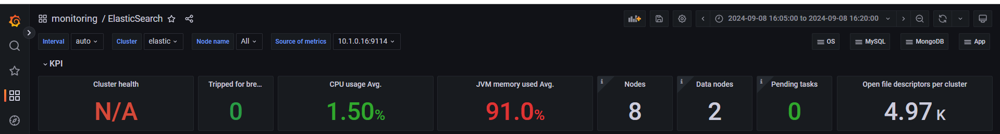
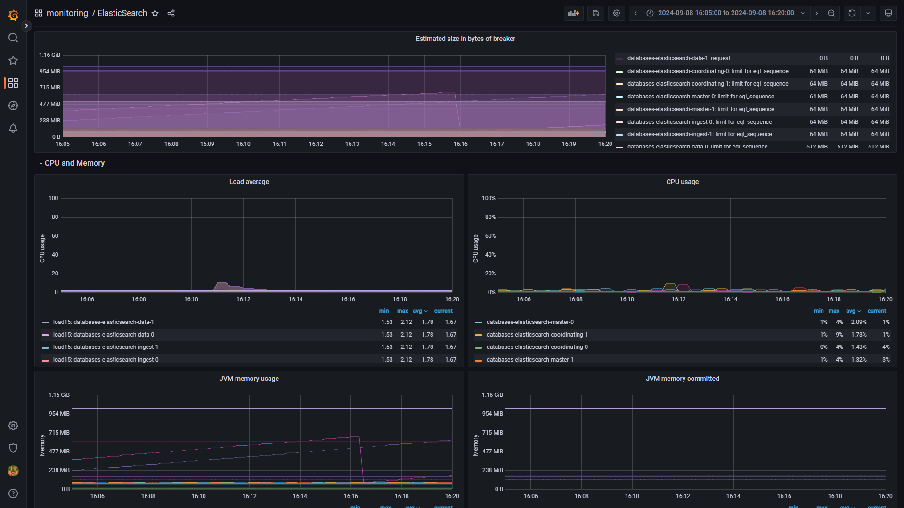

---

### Segunda Prueba:
Esta prueba es con redis
```Java
public class elasticsearchLoadTestWithRedis extends Simulation {

    // Definición de los diferentes endpoints, incluyendo el uso de Redis
    private final String[] endpoints = {
            "/elasticsearch/movies/rating?cache=redis",
            "/elasticsearch/movies/best?cache=redis",
            "/elasticsearch/movies/trend?cache=redis",
            "/elasticsearch/movies/inconsistent?cache=redis",
    };

    // Escenario con solicitudes aleatorias a los endpoints
    ScenarioBuilder scn = scenario("Random elasticsearch Endpoints Load Test with Redis Cache")
            .exec(http("Random Endpoint Request")
                    .get(session -> endpoints[ThreadLocalRandom.current().nextInt(endpoints.length)])
                    .check(status().is(200))
            );

    {
        // Configuración de HTTP
        HttpProtocolBuilder httpProtocol = http
                .baseUrl("http://localhost:49268") 
                .acceptHeader("application/json");

        // Simulación de usuarios concurrentes
        setUp(
                scn.injectOpen(
                        constantUsersPerSec(10).during(Duration.ofSeconds(900)) // 10 usuarios por segundo durante 15 minutos
                ).protocols(httpProtocol)
        );
    }
}
```
### Resultados de la Segunda prueba:
Empieza en 16:50
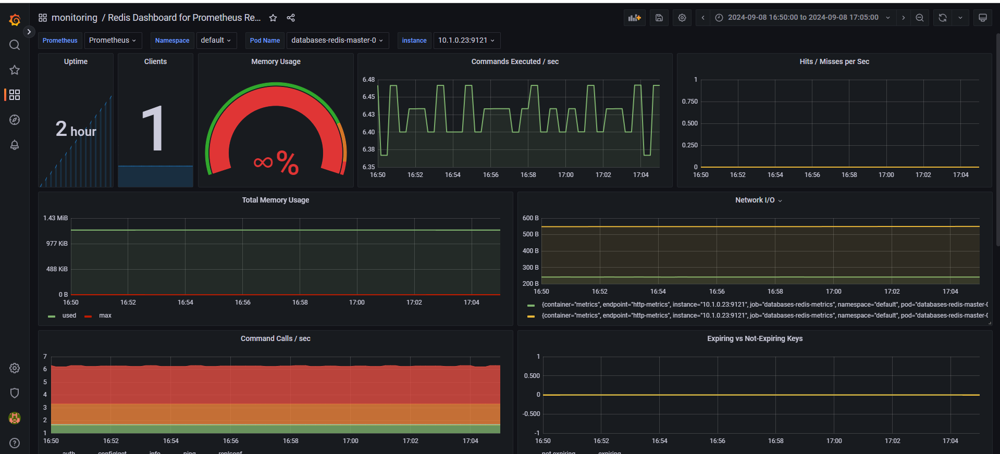
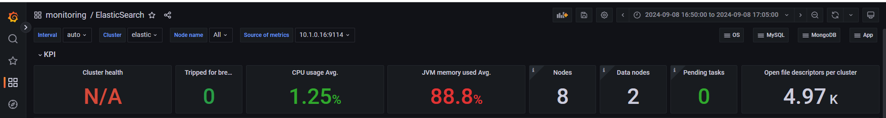
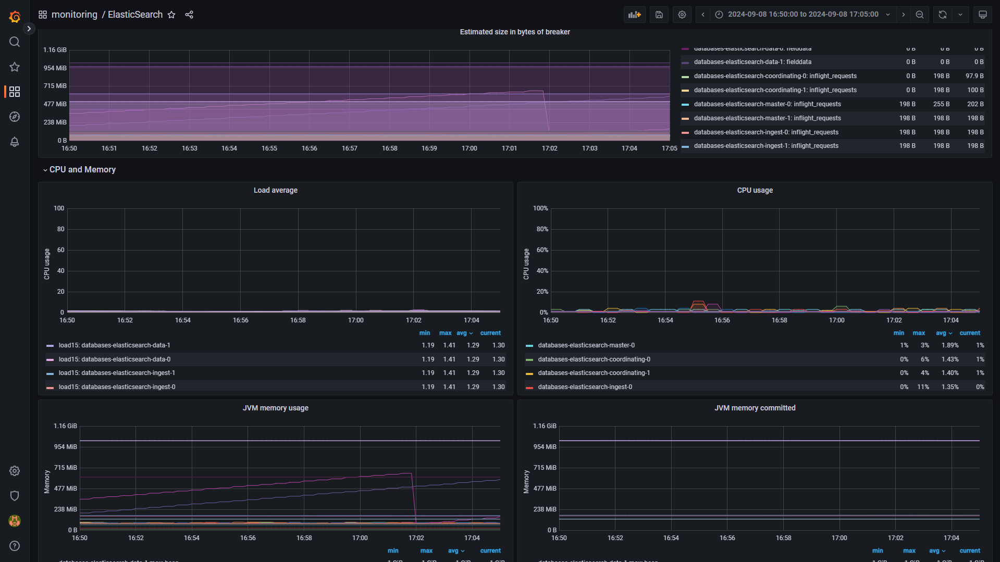

---

### Tercera Prueba:
Esta prueba es con memcached 
```Java
public class elasticsearchLoadTestWithMemcached extends Simulation {

    // Definición de los diferentes endpoints, incluyendo solo el uso de Memcached
    private final String[] endpoints = {
            "/elasticsearch/movies/rating?cache=memcached",
            "/elasticsearch/movies/best?cache=memcached",
            "/elasticsearch/movies/trend?cache=memcached",
            "/elasticsearch/movies/inconsistent?cache=memcached"
    };

    // Escenario con solicitudes aleatorias a los endpoints
    ScenarioBuilder scn = scenario("Random elasticsearch Endpoints Load Test with Memcached Cache")
            .exec(http("Random Endpoint Request")
                    .get(session -> endpoints[ThreadLocalRandom.current().nextInt(endpoints.length)])
                    .check(status().is(200))
            );

    {
        // Configuración de HTTP
        HttpProtocolBuilder httpProtocol = http
                .baseUrl("http://localhost:49268") 
                .acceptHeader("application/json");

        // Simulación de usuarios concurrentes
        setUp(
                scn.injectOpen(
                        constantUsersPerSec(10).during(Duration.ofSeconds(900)) // 10 usuarios por segundo durante 15 minutos
                ).protocols(httpProtocol)
        );
    }
}
```
### Resultados de la Tercera prueba:
Empieza en 17:20
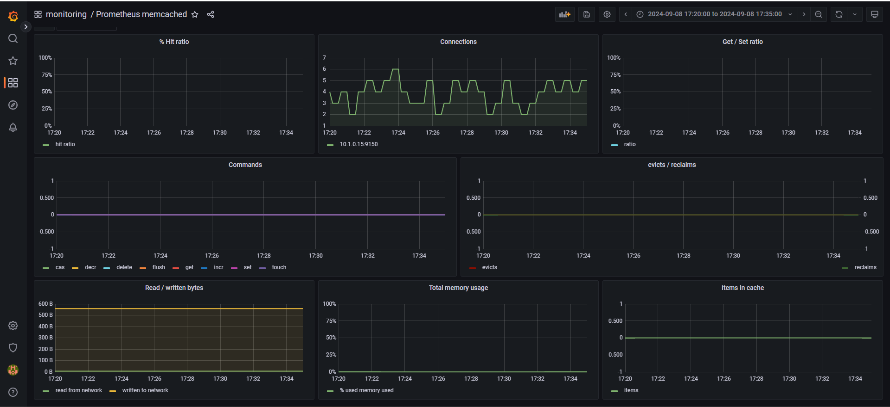
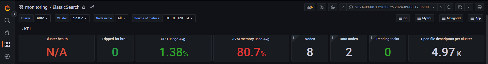
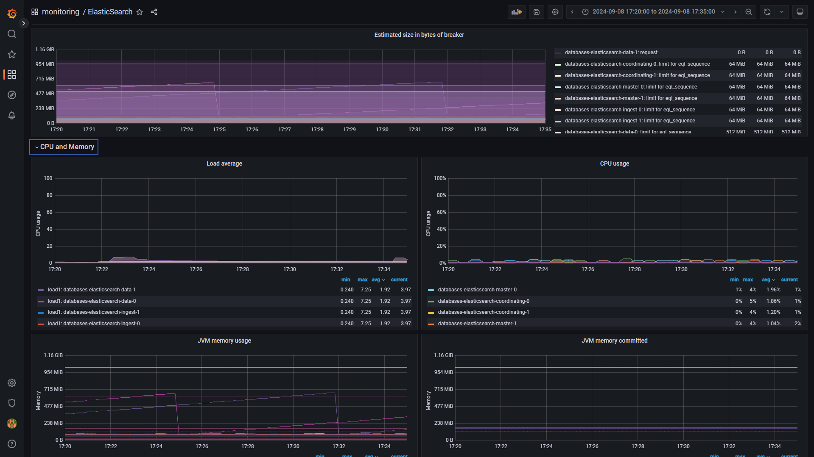

---

### Cuarta Prueba:
```Java
public class elasticsearchLoadTest2 extends Simulation {

    // Definición de los diferentes endpoints
    private final String[] endpoints = {
            "/elasticsearch/movies/rating",
            "/elasticsearch/movies/best",
            "/elasticsearch/movies/trend",
    };

    // Escenario con solicitudes aleatorias a los endpoints
    ScenarioBuilder scn = scenario("Random elasticsearch Endpoints Load Test")
            .exec(http("Random Endpoint Request")
                    .get(session -> endpoints[ThreadLocalRandom.current().nextInt(endpoints.length)])
                    .check(status().is(200))
            );

    {
        // Configuración de HTTP
        HttpProtocolBuilder httpProtocol = http
                .baseUrl("http://localhost:49268")
                .acceptHeader("application/json");

        // Simulación de usuarios concurrentes
        setUp(
                scn.injectOpen(
                        constantUsersPerSec(5).during(Duration.ofSeconds(900)) // 10 usuarios por segundo durante 15 minutos
                ).protocols(httpProtocol)
        );
    }
}
```
### Resultados de la Cuarta prueba:
Empieza en 17:40
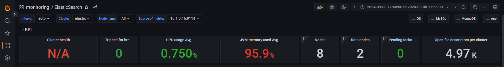
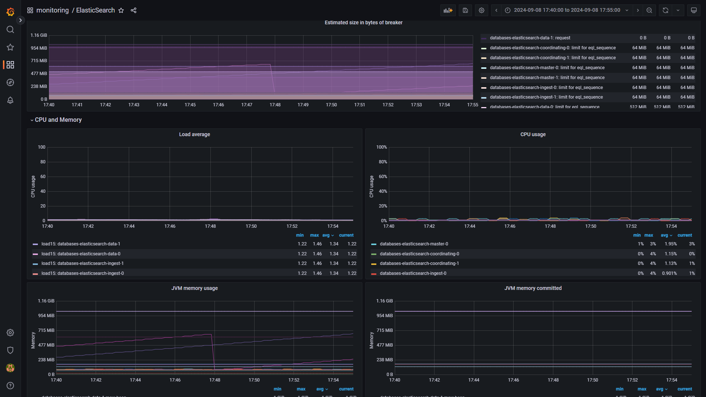

---

### Quinta prueba:
```Java
public class MariaDBLoadTest3 extends Simulation {

    // Se define el endpoint específico
    private final String endpoint = "/elasticsearch/movies/rating";

    // Escenario con solicitudes al primer endpoint
    ScenarioBuilder scn = scenario("elasticsearch Endpoint Load Test for Rating")
            .exec(http("Rating Endpoint Request")
                    .get(endpoint) // Llama siempre al primer endpoint
                    .check(status().is(200))
            );

    {
        // Configuración de HTTP
        HttpProtocolBuilder httpProtocol = http
                .baseUrl("http://localhost:49268")
                .acceptHeader("application/json");

        // Simulación de usuarios concurrentes
        setUp(
                scn.injectOpen(
                        constantUsersPerSec(20).during(Duration.ofSeconds(900)) 
                ).protocols(httpProtocol)
        );
    }
}
```
### Resultados de la Quinta prueba:
Empieza en 18:25
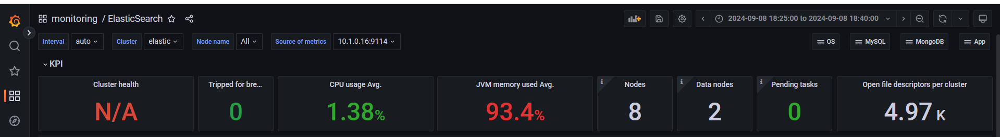
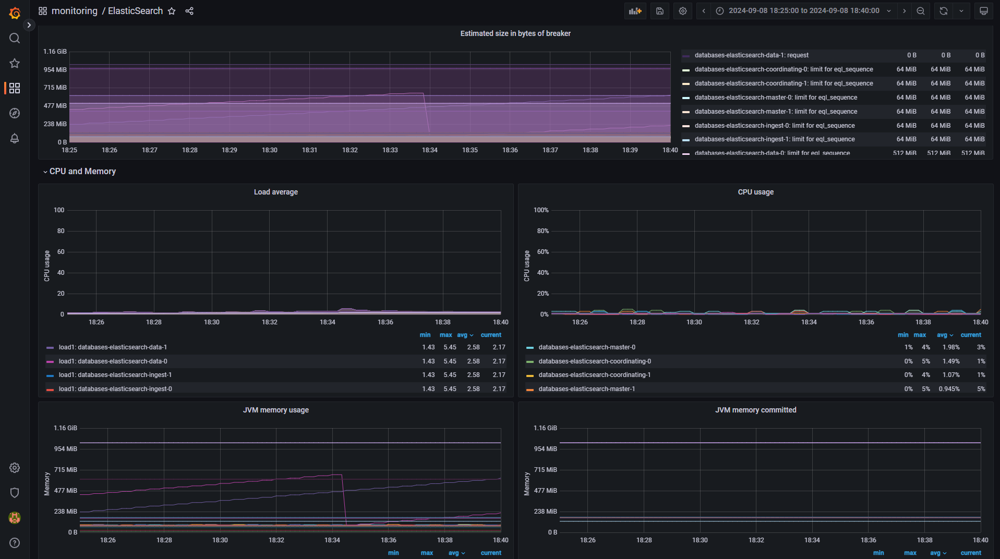

---
